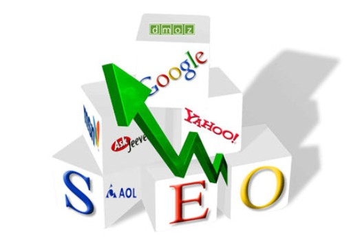
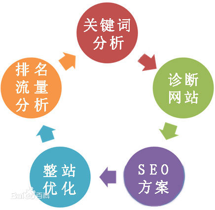
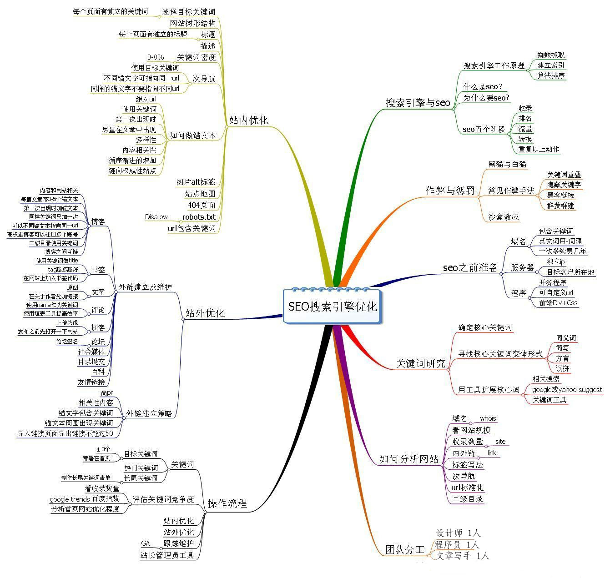
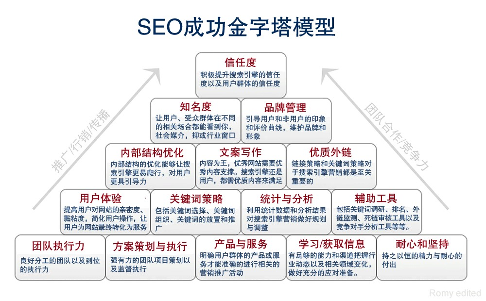

# 什么是 seo

搜索引擎优化（Search Engine Optimization，简称 SEO）是一种利用搜索引擎的搜索规则来提高目的网站在有关搜索引擎内的排名的方式。深刻理解是：通过 SEO 这样一套基于搜索引擎的营销思路，为网站提供生态式的自我营销解决方案，让网站在行业内占据领先地位，从而获得品牌收益。研究发现，搜索引擎的用户往往只会留意搜索结果最前面的几个条目，所以不少网站都希望通过各种形式来影响搜索引擎的排序。当中尤以各种依靠广告维生的网站为甚。所谓“针对搜索引擎作最佳化的处理”，是指为了要让网站更容易被搜索引擎接受。

SEO 是指通过采用易于搜索引擎索引的合理手段，使网站各项基本要素适合搜索引擎检索原则并且对用户更友好（Search Engine Friendly），从而更容易被搜索引擎收录及优先排序从属于 SEM（搜索引擎营销）。SEO 的中文意思是搜索引擎优化。通俗理解是：通过总结搜索引擎的排名规律，对网站进行合理优化，使你的网站在百度和 Google 的排名提高，让搜索引擎给你带来客户。深刻理解是：通过 SEO 这样一套基于搜索引擎的营销思路，为网站提供生态式的自我营销解决方案，让网站在行业内占据领先地位，从而获得品牌收益。

搜索引擎根据一定的策略、运用特定的计算机程序从互联网上搜集信息，在对信息进行组织和处理后，为用户提供检索服务，将用户检索相关的信息展示给用户的系统。学习搜索引擎优化 SEO，必须先了解什么是搜索引擎以及**搜索引擎原理**。搜索引擎包括全文索引、目录索引、元搜索引擎、垂直搜索引擎、集合式搜索引擎、门户搜索引擎与免费链接列表等。

在国外，SEO 开展较早，那些专门从事 SEO 的技术人员被 Google 称之为“Search Engine Optimizers”，简称 SEOers。由于 Google 是世界最大搜索引擎提供商，所以 Google 也成为了全世界 SEOers 的主要研究对像，为此 Google 官方网站专门有一页介绍 SEO，并表明 Google 对 SEO 的态度

## 搜索引擎优化
　　
一、内部优化

- META 标签优化：例如：TITLE，KEYWORDS，DESCRIPTION 等的优化
- 内部链接的优化，包括相关性链接（Tag 标签），锚文本链接，各导航链接，及图片链接
- 网站内容更新：每天保持站内的更新(主要是文章的更新等)

二、外部优化

- 外部链接类别：博客、论坛、B2B、新闻、分类信息、贴吧、知道、百科、相关信息网等尽量保持链接的多样性
- 外链运营：每天添加一定数量的外部链接，使关键词排名稳定提升。
- 外链选择：与一些和你网站相关性比较高,整体质量比较好的网站交换友情链接,巩固稳定关键词排名

## 对搜索引擎不友好的网站有哪些特征：

- 网页中大量采用图片或者 Flash 等富媒体（Rich Media）形式，没有可以检索的文本信息，而 SEO 最基本的就是文章 SEO 和图片 SEO；
- 网页没有标题，或者标题中没有包含有效的关键词；
- 网页正文中有效关键词比较少（一般小于整文章 2%~8%）；
- 网站导航系统让搜索引擎“看不懂”；
- 大量动态网页让搜索引擎无法检索；
- 没有被其他已经被搜索引擎收录的网站提供的链接；
- 网站中充斥大量欺骗搜索引擎的垃圾信息，如“过渡页”、“桥页”、颜色与背景色相同的文字；
- 网站中缺少原创的内容，完全照搬硬抄别人的内容等。

关于 seo，严谨的定义如下：seo 是指在了解搜索引擎自然排名机制的基础上，对网站进行内部及外部的调整优化，改进网站在搜索引擎中关键词的自然排 名，获得更多流量，吸引更多目标客户，从而达到网络营销及品牌建设的目标。搜索引擎检索原则是不断更改的，检索原则的更改会直接导致网站在搜索引擎上排名 的变化，所以搜索引擎优化并非一劳永逸。

在意识层面，我们对 SEO 可以形象理解为: 当用户进入搜索引擎，就好像进入了一个偌大的图书馆。那么在这个图书馆里面有非常多的分类,分类分成大分类（可以理解为书架）小分类（可以理解为书架上面的格子）以及具体到最小的分类（书本身的内容）--长尾关键词。

在图书馆里面每天都在增加新的内容，那么一个新的网站出现就等于一个分类里面的一本新书出现。那么书里面的书名以及顺序就相对应到网站的 TITLE 以及 Description。可是如果“别人”（可以指搜索引擎）进入图书馆发现这本书，虽然是这个分类或者一个系列里的书，但是这本书的书名跟之前的一些书 的书名完全一样，那么肯定会让读者误会你是在抄袭别人的书，所以原创将影响到你的排名。那么虽然你的网站是新的，但是其实在刚开始你就不可能有一个好的排 名了。这严重影响到日后的优化。

网站优化能够帮助你提高网页的综合指数，如果你的链接已经得到提升，继续保持高质量反向链接数的增加和内容的 维护，你的左侧排名会继续保持或提高。除非后期应用了作弊的方式而受到惩罚或停止后期的维护。而竞价广告如果停止了，网站链接也就会即刻消失。超过 95% 的搜索引擎使用者会优先考虑搜索引擎给出的常规结果，这其中绝大部分人只有在左侧无法得到满意结果时才会去浏览右侧的广告。

据调查显示，有 87%的网民会利用搜索引擎服务查找需要的信息，而这之中有近 70%的搜索者会直接在搜索结果的自然排名的第一页查找自己所需要的信息。

竞价广告的广告展现位置有限，竞价的结果使大量的客户因价格的原因无法排在首页，使得这部分客户很难通过竞价广告获得良好的使用效果。

