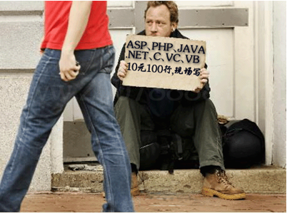

# seo 怎么优化：手把手的教你 SEO 优化代码

接触到不少的 SEOER 一听到说优化代码，就完全不懂了，其实代码是 SEO 优化一个重要部分，不然发个外链、写个文章，那么是个人基本都能够做到的，为了跟上 SEO 的步伐，学代码是 SEOER 必需经过的一段路程！



虽然有写人会觉得，代码越来越廉价，因为在购买完模版以后，模版是根据最优秀的网站抄袭的，比如博客咱们都有一个非常优秀的博客模版，他能够成功，咱就不能够拿他的模版做成功吗，所以太多人报着这样的心态去做 SEO 优化，其实这里面有严重的错误观念！比如说，在新站上线的时候，卢松松并不是使用现在的模版，因为那个的用户使用习惯接触人群并没有现在的多，所以需要根据 IP、浏览量、PV 来调整网站，最后达到优化的效果，而我们就不应该直接购买一套成功的模版去做内容和链接优化。咱还是不多说废话了，进入主题，手把手的教您把自己网站的代码给优化好！

就拿着我的博客作为例子，打开冯耀宗博客【查看源代码】，虽然看起来非常乱的代码，没关系，咱们从上往下看。

Meta 标签：如果要做的非常简单，meta 标签只需要设置一个字符编码就可以了，咱们在任意地方购买的模版都会写上字符编码，另外 Title 标题、关键词、Description 描述这里也列为 meta 标签去优化，这三个地方，一半在模版中会直接调用到后台，可以直接在后台设置，所以代码上需要基本是不需要操作。

CSS/JS 引用：在我们购买到网站模版后，大多数的网站均是调用 JS 或 CSS 的，这里需要主意的是最好使用绝对路径调用 JS/CSS，如下所示：

```　　
<LINK rel=stylesheet type=text/css href="http://ssffx.com/templets/lusongsong/style/LuSongSong-Index.css?ver=20141015
```

当然，绝对路径是全站都需要做到的，像图片、文章链接、CSS/JS 调用等。这一点是许多优化人员不知道并且没有做的一点，那么绝对路径和相对路径是什么意思呢？下面的代码就是相对路径，看完后，我相信你已经明白了，无非就是在代码中加入自己的网站域名即可。

```　
<LINK rel=stylesheet type=text/css href="/templets/lusongsong/style/LuSongSong-Index.css?ver=20141015
```

另外相信大家都看到上面这一段 CSS 的时候会感觉有点不一样，那就是我接下来要说的 CSS 设置缓存时间，当你的 CSS/JS 更新以后，浏览器会保持原来的缓存，如果不强行刷新，网站是不会更改过来，所以这里需要设置缓存时间（?ver=20141015）来帮用户更新新的界面，这一点对 SEO 没有直接作用，但是对用户体验有很大的帮助。

JS 位置：我们买来的模版，JS 绝对都是放在头部，但在优化的过程中，而 JS 文件通常是效果文件，我们可以让网站先加载主题内容，其次加载效果内容，所以有必要把 JS 文件从头部移动到底部，这样用户看起来你的网站会访问的更快，当然如果 CSS 有必要，一样可以这样做，常规的 CSS 是不建议放到底部，会影响加载效果。另外 JS 及 CSS 不建议在 html 模版中写入，最好是新建一个 JS 或 CSS 文件，然后把 JS 或 CSS 内容放入，在调用这个 CSS 或 JS 文件即可。

LOGO：LOGO 部分需要优化的主要有两个方面，第一个方面在 LOGO 处加 H1 标签，其次是在 LOGO 的 A 标签处添加一个 title 属性，title 属性中写上你优化的主关键词，之所以建议写主关键词而不写品牌词原因有两个，第一个增加优化主关键词的密度，其次是 title 属性用户很难得看得到。

广告：如果你网站是自己接的广告，那可以使用百度广告管家统计数据，同时还可以把多个广告位的 JS 整合到一个 JS 里面，这是对广告联盟的 JS 做一个何必，如果你是使用百度广告联盟，没关系，一样对接到百度管家里面，然后把广告联盟的 JS 整合到一个 JS。其他第三方的广告联盟就设置不了，也没有这个优势！

导航：导航上的优化，通常就是一个 A 标签，这个 A 标签不建议设置新窗口打开，另外一个是 A 标签中的 title 属性，如果条件允许，可以直接设置成行业词，而 A 标签中可显示的文字可以设置成品牌词，这样在不影响体验的同时一样达到了优化关键词的效果。

文章链接：文章链接通常是做两个，一个在标题上，一个做在描述上，我的博客之所以没做描述上的链接，主要是在百度热力图上并没有看到有多少人点击描述部位。不过我还是建议在描述位置增加一个 A 标签，A 标签中增加 title 属性。

这里需要提醒一点的是，当一篇文章出现两个一样的 A 标签指向的时候，我们需要用 nofollow 标签屏蔽其中一个链接，这里描述和标题都出现了同一个链接，这里建议使用 nofollow 标签屏蔽描述上的链接，加上去是为了让用户方便点击，屏蔽是为了不让搜索引擎重复抓取。

搜索：站内搜索页面本不建议做 SEO 优化，因为大多站内搜索都是动态页面，而这些动态页面均直接用 robots 了屏蔽百度蜘蛛，艾瑞网曾使用搜索结果页面做 SEO 排名被刷排名出现降权，所以我们要吸取教训，不过最好还是建议使用百度的站内搜索。这样自己网页就不会出现太多的垃圾页面收录了。

版权：版权是可以留下的，使用别人的程序不留版权是不道德的行为，所以有必要在底部留下对于的版权信息，但是版权、备案、站外链接都应该加 nofollow 标签，当然这是站外的链接，站内也有部分链接需要加入 nofollow 标签，比如我博客底部的广告合作、微信二维码、手机客户端、联系 QQ 等页面。

体验：其实在用户体验上的优化本问说的并不少很多，但代码可以决定用户体验，比如增加百度统计的返回顶部功能，文章页面增加快速评论功能、一个网站最多只能显示 3 屏、左右可以翻页等功能，看起来功能非常少，但综合的细节决定一个网站的成败！

网站地图：网站地图是搜索引擎最容易抓取的一个页面，这个页面里面有所有应该被抓取的内容，所以很多时候，搜索引擎为了偷懒，他自然会抓取网站地图文件，通常情况下网站地图的代码如下所示：

```　
<url>
<loc>http://ssffx.com/SEOjishu/</loc>
<changefreq>daily</changefreq>
<priority>0.8</priority>
</url>
```

代码非常简单 LOC 为链接、changefreq 为更新时间，我博客的更新时间为一周、priority 为权重，比如首页为 1，栏目为 0.8。

Robots：搜索引擎在抓取一个网站的时候，第一时间看 robots 文件，这里可以识别到哪些文件可以抓取，哪些文件不可以，robots 文件最主要一点就是把网站地图写上去，如下所示：

Sitemap: http://ssffx.com/sitemap.xml

总结：看了这么多，我相信你的网站也有没有完善的，赶紧行动试一下？【冯耀宗】