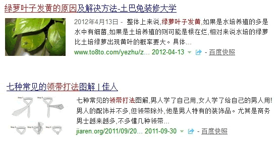

# 百度公布图文搜索结果优化方法

最近两个月大家在百度搜索时会发现一些搜索结果前增加了图片，显然在某些场景下这种展现形式明显提升了用户的检索体验：图片的直观性明显优于文字，用户通过读图可以在最短时间内就判断出页面主旨，进而快速进入内容详情页面。

这在另一方面也提升了图文结果的点击率给站长带来了更好的收益。因此，有很多站长通过各种方式进行测试或在“Lee on line”活动中进行提问，细心的朋友会发现在活动中对此也进行了回答。在这里跟大家明确的介绍一下，需要强调的一点是：希望站长不要为了出图文而刻意去做图配图，一定要根据自己的内容以及用户的阅读及使用场景，在适合的情况下进行优化。

1、目前站长只需要将图片放在页面主体内容中，百度会进行相应的图片识别及场景识别，后续会提供协议规范；

2、图片大小尽量接近121:75；

3、图片必须与页面内容紧密相关，如果出现作弊或恶劣低质图片，将有相应的处理机制：
A、屏蔽出图；B、 降低站内 url 排序；C、严重者整站将受到影响