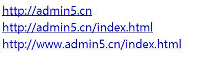

# 网址规范化优化全面大解析

前言：本篇文章主要讲解的内容为“网址规范化优化”，什么是网址规范化?做 SEO 的朋友们应该都比较清楚，指的是搜索引擎挑选最合适的 URL 作为真正(规范化的)网址的过程。

那么，为什么要写这么一篇文章呢?原因为：笔者平时在给客户网站做 SEO 诊断的过程中，发现各种各样的关于网址规范化的问题。由此可见，客户对网址规范化这块的知识点了解的非常少，甚至有的站长都不知道这个是什么。所以，为了让更多站长学习到这块的知识点，笔者写个网址规范化全面大解析。如果各位站长觉得本篇文章对自身有帮助，还请不吝分享给其他站在学习!
　　
## 一、首先，为什么会出现不规范网址?
如图所示：

上面这几个 URL 指的是同一个文件：首页
　　
从技术上来说，这几个 URL 都是不同的网址，搜索引擎也确实把他当作不同的网址，虽然这些网址返回的都是相同的文件，也就是首页。但从技术上来说：主机完全可以对这几个网址返回不同的内容。那么，除了图上带与不带 www 造成的，以及结尾是否带有 index.html 后缀造成的不规范网址外，其实还有以下几种原因会造成。例如：
1：网站程序的原因，不少 CMS 系统经常出现一篇文章可以通过几种不同的 URL 去访问。
2：URL 静态化设置存在错误，同一篇文章中有多个静态化 URL 可以访问。如图(截图 URL 和访问的标题)：

3：URL 静态化后，静态和动态 URL 共存，都有链接，也都可以访问。
4：网站的目录后带与不带斜杠。如图：
　　
下图为不同的网址，但其实是一个页面。

5：加密网址。如图：
　　
下图的 URL 同时存在，但都可以访问。

6：URL 中有端口号。如图：

7：跟踪代码。有喜欢做网络推广的人，习惯在 URL 后面加跟踪代码。如图：

## 二：其次，出现网址不规范会给网站带来什么问题?
网站出现多个不规范网址会给搜索引擎收录和排名带来很多的麻烦，这个已经是毋庸置疑的了。但是，还有不少站长对这个网址不规范不是很重。例如笔者在给意向客户看网站时，发现不少网站的 URL 没有做网址规范化。当问他们为什么不做 URL 规范化?客户回答：什么是网址规范化，怎么做，会写在诊断建议方案上吗?当场就醉了......还有一部分的 SEO 诊断客户，诊断的过程中发现网站的 URL 不规范问题很严重。这里，也希望这些部分站长能够在看完本篇文章后学习到规范化知识点。我们接着阅读.....
　　
为什么不规范的 URL 会给搜索引擎和排名带来很多麻烦?为了让站长彻底的明白，我们举个例子，比如：网站首页是固定的且只有一个，但很多站长在链接回首页的时候所使用的 URL 并不是唯一的，而是一会连到 http://www.admin5.cn，一会连到 http://www.admin5.cn/index.html。
　　
一般来说，虽然不会给用户造成什么麻烦，但因为这些网址都是同一个文件，会间接性的给搜索引擎造成困惑，搜索引擎会认为：到底哪一个网址才是真正的首页?哪一个网址应该被当作首页返回?那么，这里有个重点：如果网站上不同版本的网址同时出现，就会很可能被搜索引擎收录。被收录之后，后果就可想而知了。而此时，搜索引擎在计算排名的时候必须要找到所谓规范化的网址，也就是搜索引擎认为的最合适的 URL 版本。
　　
不规范化会造成的问题，笔者简单的来说下：
1： 网站上有多个 URL，这样会分散页面权重，不利于排名。
2：搜索引擎判断的规范化网址并不是站长想要的那个网址。如图(站长想要的是不带后缀的，搜索引擎去把带后缀的给收录了)：

3：如果网址规范化问题太严重，也可能影响收录。因为：一个权重不是很高的域名，能收录的总页面数和蜘蛛总爬行时间是有限的，而搜索引擎把资源花在收录不规范的网址上，留给独特内容的资源就变得越来越少了。
4：重复页面过多，搜索引擎可能认为有作弊嫌疑。
5：对于搜索引擎来说，浪费资源、浪费宽带。
　　
## 三、最后，如何解决网址规范化的问题
关于如何解决网址规范化问题，可能这个对于站长而言是重点也是核心内容了。那么，可以解决 URL 规范化问题的方法有很多，比如接下来我们要说的这些：
1：现在企业、个人站长用的程序最多的就是 CMS，那么此时你就要确定你使用的这个 CMS 系统是否只能产生规范化网址，无论是否有静态化，比如 DEDE、帝国 CMS 等。
2：所有内链要保持统一，都指向规范化网址。比如：以带与不带 www 为例子，确定一个版本为规范化网址后，网站的内部链接都要统一使用这个版本，这样搜索引擎就会明白哪一个是站长希望的网站规范化网址。而从用户体验的角度去看：用户通常第一选择就是带 www 的版本为规范化网址。
3：301 转向。这个最常用也是最普遍的一个方法，站长可以通过 301 转向把不规范化 URL 全部转向到规范化 URL。
4：canonical 标签。目前也是站长使用比较多的一种了，而且百度也是全面支持这个标签了。
5：制作 XML 地图，地图中全部使用规范化网址，然后提交给搜索引擎。
　　
虽然方法很多，但很多方法都有局限性，比如：有的网站因为技术的缺失或不成熟，导致 301 无法实现。再比如：很多 CMS 系统经常无法受自己控制等等。那么，笔者这里主要针对 301 和 canonical 做下具体的说明，因为这两种规范化方式是站长最常用的手段，而且也是百度最认同的。我们继续阅读.....
　　
网址规范化 之 301 转向：
1：什么是 301 转向?
301 转向又称 301 重定向、301 跳转，是用户或蜘蛛向网站服务器发出访问请求时，服务器返回的 HTTP 数据流中头信息部分状态码的一种，表示本网址永久性转移到另一个地址。
　
另外，还有其他的网址转向方法，例如：302 转向、javascript 转向、PHP/ASP/CGI 程序转向等。这里有个重点：除了 301 转向外，其他的方法都是常用的作弊手法，虽然方法本身没有对错之分，但被作弊者用多了，搜索引擎对可疑的转向都是非常敏感等。所以，其他的方法还是少用为妙。
2：301 转向传递权重
　　
例如：网页 A 用 301 重定向转到网页 B，搜索引擎可以肯定网页 A 永久性改变地址，或者说实际上不存在了，搜索引擎就会把网页 B 当作唯一的有效目标。而且，更重要的是：网页 A 积累的页面权重将被传递到网页 B。
　　
举个例子：http://www.admin5.cn/是选定的规范化网址，下面的几个网址都做 301 转向到选定的规范化网址上，这样搜索引擎就知道它是规范化网址，而且会把这三个网址的权重都传递集中到规范化网址上。

可能有站长会问：301 转向多久可以生效?一般来说的话，在百度站长工具的改版工具上做下规则提交，大概一周左右就会生效。如图：

3：怎么样做 301 转向?
　　
关于怎么做 301 转向，这里建议参考这篇文章：(http://www.chinaz.com/web/2013/1212/330808.shtml)本篇文章，有详细的 301 转向操作方法，完全适合个人站长和企业站长。由于文字太长，这里就不写了。
　　
网址规范化 之 canonical 标签(参考下百度站长平台给出的标准)：
1：canonical 标签有什么作用?
　　
对一组内容完全相同或高度相似的网页，通过使用 Canonical 标签可以告诉搜索引擎哪个页面为规范的网页，能够规范网址并避免搜索结果中出现多个内容相同或相似的页面，帮助解决重复内容的收录问题，避免网站相同内容网页的重复展示及权重的分散，提升规范网页的权重，优化规范网页的排名。

2：如何用 canonical 标签指定规范网址?
　　
可通过在每个非规范版本的 HTML 网页的 部分中，添加一个 rel="canonical" 链接来进行指定规范网址。
　　
例如，要指定指向网页 http://www.admin5.cn/product.php?id=15786 的规范链接，需要按以下形式创建 元素：

然后将上述链接复制到某网页所有非规范网页版本的 部分中(例如 http://www.admin5.cn/product.php?id=15786&active=1)，即可完成设置。

3：可设置规范网页的几种情况举例：
举例一、社区帖子可能由于置顶、突出颜色等行为导致内容完全相同的一个网页产生不同的链接，搜索引擎只会选择其中一个链接建立索引，如以下两个链接不同，内容完全相同的页面：
http://www.a5.net/forum.php?mod=viewthread&tid=17868770&page=1#pid115642474
http://www.a5.net/thread-17868770-1-1.html

举例二、对商品的列表页面，按照价格或者优惠等顺序进行排序，但网页内容高度相似：
http://mall.leho.com/pr-list?locid=75fb2a357d38397c5e1e75fa&cid=5e1e02f950a4101fb27571ee&order=discount
http://mall.leho.com/pr-list?order=price_asc&locid=75fb2a357d38397c5e1e75fa&cid=5e1e02f950a4101fb27571ee
　　
举例三、网站有多个网页展示的为相同型号的商品，只是每个网页商品图的颜色不同，其他内容几乎完全相似，此时也可设置 rel="canonical"，将当下最流行色彩的商品网页设置规范网页，推荐百度有优先将其显示在搜索结果中。

4：百度会完全遵守 rel="canonical"标签吗?
网页中添加该标签后，就代表站长向百度推荐某个网页作为最规范的网页版本，百度会同时根据标签的推荐及系统算法选择出最合适的网页将其显示在搜索结果中。百度会根据网页内容实际情况考虑 Canonical 标签中推荐的网页，但不保证完全遵守该标签。为了保证标签的效果，请保证一个页面中仅有一个 Canonical 标签。
　　
5：此链接是相对的还是绝对的?
rel="canonical" 可与相对链接或绝对链接一起使用，但建议您使用绝对链接，以最大程度地减少可能出现的混乱或问题。

6：rel="canonical"标签可用于在不同的域名中建议规范网址吗?
如果网站需要更换域名，且使用的服务器不能创建服务器端重定向网址的情况下，就可以使用 rel="canonical" 链接元素指定希望百度收录域的网址。
　　
写在最后：
关于网址规范化，本篇文章给出了最详细的文字说明，希望个人和企业等站长在看完本篇文章后，能够更多的掌握住网址规范化的知识点和操作方法。当然，如果您觉得本文帮助到您了，请不吝分享一下，将它传播出去。