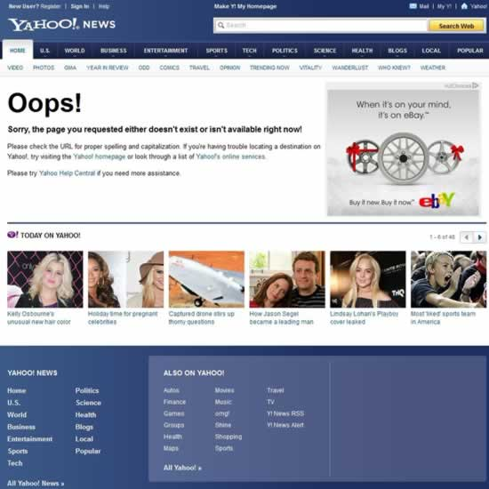

# 404 页面设置方法_404 页面案例

**404 页面设置方法**
1：虚拟空间设置方法
现在的 idc 提供商基本都提供 404 设置的功能，直接上传文件设置即可。每个空间商的控制面板都不同，我在这里就不多说了。

2：IIS 下设置 404 页面
在 IIS 管理器中右键单击要管理的网站，打开“属性”中的“自定义错误信息”页，为“404”设定相应的错误信息页即可。不过，此处在“消息类型”中一定要选择“文件”或“默认值”，而不要选择“URL”，不然，将导致返回“200”状态码。
　　
3：Apache 下设置 404 错误页面
在.htaccess 文件中加入如下内容即可：ErrorDocument 404 /notfound.php。切记不要使用绝对 URL，如果使用绝对 URL 返回的状态码是“302”+“200”。
　　
在设置好以后最好再检查一遍网页的 http 状态，可以用 ranknow 这个工具：检测你的站点 404 设置的是否正确。
　　
404 页面是网站必备的一个页面，它承载着用户体验与 SEO 优化的重任。404 页面通常为用户访问了网站上不存在或已删除的页面，服务器返回的 404 错误。如果站长没有设置 404 页面，会出现死链接，蜘蛛爬行这类网址时，不利于搜索引擎收录。

**设置 404 页面的两大好处**
1：引导用户不要关闭网站，增强用户体验。
2：防止网站出现死链接。
　　
**设计 404 页面的你可以遵循以下几条原则**
1：像门户一样 5 秒返回首页

据卢松松观察，像网易、新浪、腾讯这类门户站的错误页面都是一样的，进入错误页面后提示 5 秒后返回频道首页。

切忌不要进入 404 错误页面后，立刻返回首页，这些转向都使搜索引擎误以为页面存在，却返回重复内容。
2：像站长之家一样放出“砖家”

404 页面要保证与自身网站风格类似，让它看上去还是你的站，再来点幽默搞笑的短语，请“砖家”帮你分析，告诉用户迷惑的时候知道他在那里。给错误带上幽默的情节，原来错误也可以很美……
　　
切忌不要把 404 设置成 301 重定向到首页，这是对搜索引擎不友好的设置，会让搜索引擎认为网站上有大量与首页内容相同的页面，但可以把错误页面 301 定向到正确页面。
　　
3：也可以像 Yahoo 一样，能放的全塞进去

在 404 页面尽可能的给出对用户有用的链接，用丰富的内容把用户拉回来，避免过于简单的网页而让用户离开。
　　
尽管内容很多，但最醒目的位置依然显示错误信息，提示用户，要访问的页面不存在。然后，上面加入导航，右边放上广告，下面再挤点图文并茂的文章，这还不够，最下面在仍点导航链接进去，用户想不点都不行啊。

4：还可以像我这样，放个小游戏玩玩

404 错误并不可怕，可怕的是默认的“404 Not Found”让用户摸不着头脑，这是怎么了？卢松松博客的 404 页面就是用的一段 flash 小游戏。
　　
哎哟，这就是 404 错误页面了，来休息一下吧，玩玩这个游戏。