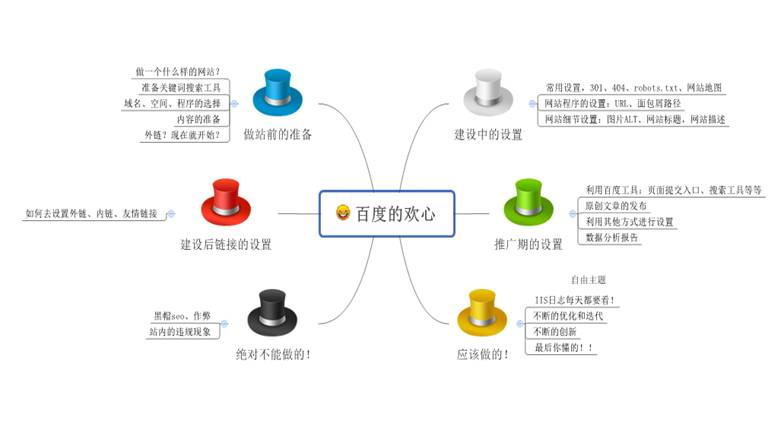

# 如何加快百度对新站点的收录，以及如何快速提示新站点排名?

## 一、 概述与分析
如何让百度快速的收录网站？这应该是很多新站长一直关心的问题，当然也有各式各样的回答，比如说原创，外链，友情链接…….等等，有的站几天就收录了，有的站却 2 个多月都没收录，那么到底是什么因素导致百度收录和排名有所差距呢？

“内容价值！”——是的，你的内容对百度、用户的价值，是影响收录和排名的决定性因素！那什么样子的内容是有价值的呢？简单的说就是对用户有用的东西，用户会去搜索的东西，那么百度就能快速的收录，也能快速的给予排名。如果说百度不展示用户感兴趣的东西，那么大家就会去用 360，搜搜这样的搜索引擎，度娘当然不会那么做。所以说如何做一个讨度娘欢心的网站，要做的就不单单是原创！原创！原创！你原创的在给力，不是度娘与用户喜欢的类型，那么不好意思，你的网站永远不会放出！那应该如何去做呢？

一张图，来概括

## 二、 做站前的准备
“战略上藐视敌人,战术上重视敌人”毛爷爷的经典语录，同样我们要在战略上藐视算法的更新，战术上要重视算法。所以说从一开始我们就要有一个详细的计划，逐步的拿下度娘！那么我就说一下我这么多年来是如何”泡度娘“的吧！

### **第一步：做一个什么样子的网站？和使用的小工具。**

这是一个非常艰难的决定，因为你总会觉得自己的内容度娘绝对会喜欢，也会有大量的粉丝，只要您的网站一上线！网站流量就像流水一般的来临了，但是你做的内容真的能吸引用户、吸引百度吗？什么样子的内容才是百度与用户喜欢的内容呢？其实利用几个简单的小技巧就能判断出来的！

1、利用百度下拉框，如果没有下拉窗，说明此关键词实在是太好做了，只要你补充完首页的内容基本就上去了。

2、如果有下拉框，在看相关搜索，比如说你查看了一个下拉窗里面包含的怎么样？比如：一个产品贵不贵的话，那样你就要在你的网站页面做上客户需要的产品，比如说介绍价格，介绍我们的优势，那样我们要做一个 FAQ 常见问题解答，需要解决的是解决价格的问题。

3、查看网站排在前面的网站有无吸引点；

4、利用百度统计工具查看流量的关键词来源；

5、利用百度推广助手工具查看关键词。

### **第二步：域名、空间、程序的选择**
域名：对于域名来说，我建议使用与内容相关的域名，简单的说：如果我做的网站是百度站长社区，那么我的域名的网址中最少要包含：zhanzhang 这样的词组，不单单是为了收录，更多的确实为了用户的记忆。

PS：当然也有人说域名备案后，收录会好一些，我个人对这个看法有一定的赞成。

空间：对于空间的选择比较简单一些，但是还是要提醒大家，尽量的选择大的空间商，如万网，新网等，有很多的网站为了限制流量和赚钱甚至屏蔽了百度蜘蛛，慎重！

PS：我实在是要吐槽一下，不要被便宜所吸引，还有服务器上的安全狗，有时候会进行误杀，慎重！

程序：如果说评选什么程序是最会被攻击的程序的话，我个人认为织梦系统完全可以自己一个人拿 100 分，没有错！织梦程序绝对是被黑中的战斗机，你不会认为网站每天都被黑，还能给一个好的收录和排名吧？所以说程序的选择也是相当重要的，而且现在百度站长工具对 DZ 系统和 WordPress 推出的结构化数据插件还是很给力的，不妨试下。

PS：网站空间的稳定性是决定着网站是否能真正的成为一个“网站”的基本要求！

### **第三步：内容的准备！**
灰常重要的一步，我还是一开始那样的看法，请不要把原创当成百度必须收录的你标准，不是说我原创了，百度一定就收录了，那么你胡乱的打一些代码上去就可以了，这绝对是原创，但是百度会收录吗？显然是不能的！所以你要创造有价值的内容才是关键。

PS：我建议做网站之前，最好有 100 篇的文章已经预备好了，这个预备会让你的内容不至于在急促的情况下更新不了！

### **第四步：外链建设**
说到这里，你是不是就会问了，我网站都没建设好，我怎么发布外链呢？其实很简单，在你网站预上线的 2 周内进行外链的发布，就足以让你的网站快速的被收录，注意这不是在作弊，这只是提前把内容推荐给百度而已，当然前提是你要有内容！

## 三、 建设中的设置
如果说建设前的设置是代表出身的话，那么建设中的设置就代表着你的长相了，为了成为网站内部的“高富帅”你还要做好以下几点！

### **第一步：常用设置：　**　
简单的设置往往能起到很显著的作用，比如你的网站地图，会让蜘蛛抓取你的网站更加的频繁，那么都有什么基本设置呢？

301 重定向：想集中权重？想让用户看到你新网站的内容，那么你去做 301 吧，你只要有了 301，妈妈再也不用担心我的网站会让不带 www 比带 www 的排名好了！

404 页面：告诉浏览者其所请求的页面不存在或链接错误，同时引导用户使用网站其他页面而不是关闭窗口离开。当然最重要的是告诉搜索引擎，我这里还是有内容的，爷！可以去首页看一下吗！

Robots.txt：关于 robots 的编写，我建议直接使用百度站长工具进行编写，那样会大大的降低写法的错误！

网站地图：网站地图非常的重要，网站地图的设置主要是为了让搜索引擎搜录更多你网站比较“深”的信息。

### **第二步：网站程序的设置：**
在建设网站中，除了上面几点的基础设置外，还是需要注意一下别的设置，比如说：面包屑路径的设置，URL 的设置等等。

面包屑导航：面包屑路径来源于一个故事"汉赛尔和格莱特"，当汉赛尔和格莱特穿过森林时，不小心 迷路了，但是他们发现在沿途走过的地方都撒下了面包屑，让这些面包屑来帮助他们找到回家的路，所以，面包屑导航的作用是告诉访问者他们目前在网站中的位置以及如何返回。

面包屑路径的好处：
（1）、让用户了解当前所处位置，以及当前页面在整个网站中的位置。
（2）、体现了网站的架构层级，能够帮助用户快速学习和了解网站内容和组织方式，从而形成很好的位置感。
（3）、提供返回各个层级的快速入口，方便用户操作。
（4）、Google 已经将面包屑导航整合到搜索结果里面，因此优化面包屑导航每个层级的名称，多使用关键字，都可以实现 SEO 优化。面包屑路径，对于提高用户体验来说，是很有帮助的。
（5）、方便用户，面包屑主要用于为用户提供导航一个网站的次要方法，通过为一个大型多级网站的所有页面提供面包屑路径，用户可以更容易的定位到上一次目录，引导用户通行；
（6）、减少返回到上一级页面的点击或操作，不用使用浏览器的“返回”按钮或网站的主要导航来返回到上一级页面；
（7）、不用常常占用屏幕空间，因为它们通常是水平排列以及简单的样式，面包屑路径不会占用页面太多的空间。这样的好处是，从内容过载方面来说，他们几乎没有任何负面影响；
（8）、降低跳出率，面包屑路径会是一个诱惑首次访问者在进入一个页面后去浏览这个网站的非常好的方法。比如说，一个用户通过谷歌搜索到一个页面，然后看到一个面包屑路径，这将会诱使用户点击上一级页面去浏览感兴趣的相关主题。这样，从而，可以降低网站的总体跳出率；
（9）、有利于百度蜘蛛对网站的抓取，蜘蛛直接沿着那个链走就可以了，很方便；
（10）、面包屑有利于网站内链的建设，用面包屑大大增加了网站的内部连接，提高用户体验。

面包屑导航的分类:
（1）、基于位置的面包屑导航
这种类型是最常见的。这种类型的面包屑导航可以很好的指出当前页面与整个站点的层次结构。这种面包屑导航可以显示当前页面的前一个页面或者目录的链接。可以使访客了解自己的位置，以及可以更快的找到自己想要到达的页面。可以很好的提高用户的友好体验。

（2）、基于属性的面包屑导航
这种面包屑导航最常出现在电子商务站点。这种面包屑导航可以很好的指出当前页面内产品的其他属性或者类别。对于一个产品来说，所具有的属性往往不只有一种，而通过这种面包屑导航可以给消费者一个更加直观的了解。

（3）、基于路径的面包屑导航
这种面包屑导航是最不常见到的。这种面包屑导航和上文所说的童话故事类型很像。他们可以显示访客在到达页面前所访问过的网页的链接。这种面包屑导航不是很受欢迎，因为他们的功能基本上是和前进和后退的按钮是一样的。

面包屑导航适合的网站：
并不是说所有的网站都适合面包屑导航，那什么样子的网站适合面包屑导航呢？
（1）层次较浅的网站，一般的像大网站就不适合这个导航，比如说豆瓣网。
（2）独立不交叉的网站结构，由于面包屑网站导航路径是线性结构的，因此网站内容必须划分的非常清晰，且不存在交叉；否则，面包屑导航的路径就不是唯一的，同一分类可能出现在不同的路径中，让用户感到困惑。

URL 问题：
（1）URL 的长度百度给的建议是“url 的最长长度不超过 255byte”；
（2）URL 样式：分为动态路径和静态路径，建议还是静态路径；
（3）url 要使用绝对路径：可以有效的防止网站被人家把恶意镜像。还有一重要的作用就是，网络中如果有人引用了你的网站内容，你会获得来自外界的导入链接
（4）301 一定要做，把权重集合一下。
（5）URL 一定要容易记住和栏目相关：好记大家都知道，相关的域名是这样的设置,比如说新闻栏目，应该这样写：xxx/xinwen.html，可以把关键词加上去
（6）404 页面等常用的页面要做
（7）静态页面使用动态参数：需要设置：<meta name="robots" content="nofollow" /

### **第三步：网站的细节设置**

在这个细节决定成败的时代里，我们每做好一步细节都能是网站的收录与排名上升一个档次，这里只举一个例子！

图片 ALT 属性：图片一定要添加 ALT 属性，大到幻灯图，小到一个图标都要添加，描述方法：“例如我有一只黑色的小猫在玩球”（谷歌搜索引擎指南举得例子）。但是不能堆积关键词。

## 四、 网站完成后的操作
网站做完了，真的就没有事情了吗？当然不是，做完了网站，我们还有很多的事情可以做！比如说现在就需要建设外链了！

### **第一步：外链的建设：**
关于如何寻找外链资源，我就不在这里罗嗦了，因为太多的教程了，我也不能进行更多的创新，所以我就不在这里献丑了，那么我说一下我对外链建设的基本看法。

1、产品相关：我做的是一个 seo 教程和网络营销教程免费下载的网站，所以主要的客户是学习 seo 的，或网络营销的，那我需要寻找的外链地址必须和这个相关了，（很多人会说这一步很多余，但是很多的时候我们都是哪里好做外链区哪里做，不是吗，相关性我们已经不考虑了。。）

2、什么方式去推广：我是以回答别人的问题？还是去寻找问题，还是去发布文章或者软文去吸引流量呢？或者说我是直接上去推广广告呢？我定性为回答问题和发布文章！所以我需要准备 50 篇文章和需要回答的问题大概。比如说我擅长 301 的制作（只是比喻），我就可以寻找和回答关于 301 的问题，正好我的网站也放了一篇关于 301 如何去做的视频。这样我就可以把这个人导向我的网站，他就可以在我的网站上需找到他需要的产品。

那如何做连接呢？请看 3
3、如何做连接，如果你这样问我只能说，你的思路错了，为什么呢？
@、我们做连接是为了让别人进入我们的网站，或者是搜索我们的网站，并不是单单为了排名，
@、我们做连接可以是纯文本，也可以只写上：百度一下：XXX 网站。客户需要的是找到他的需求。
@、如果你只是想提高排名的话，也许你的网站并不能稳定多久，因为搜索引擎每次升级都会改变算法，但是有一个他不能改，就是客户需要的他不能违背，所以我建议大家多多做客户需要的连接。
@、如何判断客户群？客户需要的产品需要的功能包含：，1、价格，2 性能，3、其他。比如说我做的求婚策划的营销，客户关心的是你的创意点是什么？女生关心的是价格，那么我这个求婚策划要解决外链的发布地如何解决呢？1、我思考的是本地白领的社区，2、90 后的社区，3、90 后的群。4、一些 90 后的贴吧，我只要把内容做好，当然不会缺少订单的。

4、视频，图片，GIF 格式的图片都是需要做的，这个明天出个教程，如何去做这些的营销。

5、友情连接的设置：
1.他的网站是不是经常更新，
2、他的网站内容是否是采集的？
3、他的网站的友情连接是否是稳定的?
4、他的网站是否安全（织梦我就不喜欢，哈哈）
5、你需要网站的联系人的电话，QQ 号等，我记得有一起我网站改版，我就一个个的打过去，别人等我修改好了就加上了我的连接，所以信用很关键哦！

### **第二步：工具篇**
工具是人类发展史上的最伟大的发明，所以充分的利用好工具吧！
1、百度提交入口：不要怀疑这个入口是否好用，可以这样跟您说，这个入口真的非常好用，一般成功的几率高于 80%，当然你要对你的网站内容有绝对的信心。

2、百度站长工具：如果你用的是 DZ 系统，我建议你速度认证下站长工具，申请下数字化结构插件，那么你的网站就会走上人生的巅峰的。

3、百度分享、百度统计、百度工具的抓取诊断：这些都是收录的秘密武器！

4、360 搜藏，百度知道，百度贴吧，百度文库等平：利用好这些平台进行外链的建设，会让你的网站事半功倍的哦！

## 五 提升排名的决定性因素
现在很多的所谓的快速获得排名的方法都是在玩火，如果要安心的做一个站的话，只要安安静静的去做，按照搜索引擎指南去做，不能说快速的获得排名，但是绝对不会落后太多！

一个网站想要获得排名，我还是那句话：

“内容价值！”——你的内容对百度、用户的价值，是影响收录和排名的决定性因素。

我没有什么能让你的网站一天上前三页的技巧，也没有能让你网站 3 个小时上首页的特技，我有的只是让网站走上正轨，单纯的去做一些搜索引擎喜欢的设置，其实就是比别的作弊网站排名快了，不是吗？

## 问答部分：
第一位童鞋：
为何新网站一直不被收录？正规新站，更新了内容，也提交了反馈，还百度快照投诉、URL 提交各种手段都用了，其他搜索引擎都收录了，就是百度不收录，感觉 P2P 站最近百度有人为操作啊，诶！！！！！！！！！！！
回答： 百度绝对不会对网站进行人工操作，如果网站正常的更新内容，也提交了窗口，不妨试下下面几个方面:
1、 对内容进行进一步的编写，多去看一下排名好的网站的内容是如何做的？
2、 一个新站的审核期需要一定的时间，可以尝试着在百度搜索上进行站点搜索，提醒百度放出页面；
3、 坚持下来，坚持是做好一个网站的基本素质；
4、 尝试下外链的发布，友情链接的兑换等方式，
5、 可以尝试百度推荐的各种工具你懂的！

第二位童鞋：
最近两个新站，正规备案，提交了百度很长时间了，一点收录的动静都没有？大家有没有遇到类似的收录问题　　
答：
新站不收录的因素比较多一些建议从以下几个方面进行设置：
1、 站内的设置，基础要设置好，比如说地图、301、404 等；
2、 外链的建设：需要在各大平台上进行外链发布，吸引蜘蛛；
3、 查看日志：吸引后查看日志是没有蜘蛛抓取还是抓取后没有放出，如果是后者请更新下内容的质量问题。
4、 使用百度推荐的工具，所有工具都来一篇，你懂的！

第三位童鞋：
新站天天更新，为什么百度 site 一直只有首页？
答：每个新站都有一定的考核期，你的网站首页被放出说明网站已经参与排名，需要注意的：
1、 网站需要每日更新，更新的内容要比以前更加丰富一些；
2、 查看下 IIS 日志，网站的内页是否被抓取？没有被抓取的话提交下网站地图。
3、 坚持做外链与内容文章的更新，估计 2-4 周其他内页就会被放出。