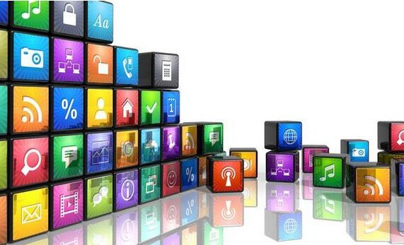

# 详谈高性价比的推广方法有哪些

渠道为王已经是老生常谈的事情了，基本大家也都默认了这个规则。当然，前提是你的产品在水准线之上，否则导流来的用户很快流失，没有意义。当然，今天我们不谈产品，还是说渠道。这是一个比较复杂的东西，想做好有很多细节。下面我就从 APP 和 PC 产品的推广来说一下。

## 一、App 推广 应用商店(ASO、资源互换)

应用商店里怎么去推广你的 APP，这个我大概提两点，一个是 ASO，一个是资源互换。其实大家平时做应用商店这份工作，无非就是首发、专题、活动啊这几个常用的方式。
　　
首发就是那几个大平台：91 手机助手、应用宝、360 商场……另外还有小米、华为的应用商店也算很大的应用商店了。这几个平台的市场覆盖率可能是 80%—90%，别的平台可能量就比较小了。还有豌豆荚，虽然现在也有一定的量，但是可能不如以前的量大了。一般首发也就是在这几个大的选一家，不过你可以和他们谈一下~。不过约首发的话，之前的一个同事告诉我因为靠微信、QQ 这种腾讯的大资源所以应用宝的量起来很快。还有我觉得大家可以去尝试一下活动和专题。
　　
活动的话，每家的门槛不一样，有些贵有些少。比如 360 好像是 5000 元就可以参与，但是百度似乎要 10000 元。这个大家可以具体去问一下各个市场的负责人。
　　
关于 ASO
　　
实际上现在互联网上关于 ASO 的文章很多，本站就有不少，大家可以去详细看看，这里简单说下，主要是 9 个元素：
　　
应用名称;应用关键字;应用描述;应用 icon;应用截图视频;应用评价;应用安装量;活跃用户量、活跃用户比例;社会化分享数据。
　　
其实 ASO 并没有大家说的那么难，只要大家去认真研究一下上面说的这 9 点，每一块都做得特别标准就好。
　　
应用名称：因为 APPstore 后面是可以加后缀的，比如说唱吧，后面有一个最好的手机 KTV，会带上自己的关键字。因为用户有一些常规搜索词汇，如果你研究过 SEO 就会发现，影响 SEO 最核心的因素是 title，就是标题。所以大家说 SEO 都知道怎么回事，但具体不会操作。但是你要注意带关键字一定要是通顺的一句话，很清晰，不能牵强附会，不然容易审核被 BAN 掉。
　　
关键字和标签：之前我提过一些，看看竞品在用什么关键字，还有就是后台里面用户最常用的关键字，然后设置好就好了。应用描述：你提交 APP 的时候，实际上那个描述也可以扣一下关键词，但是要通顺，而且用户描述一定要吸引人，把亮点和卖点凸现出来。这个更多考验的是文字能力和你的概括能力。
　　
icon：可能每个平台的提交大小不一样，但是这个东西要选一个让人一目了然，很容易被记住的图标，AppStore 里面好像用英文字母 Q/S/A/B 这类比较多一些，可能比较素一些。当然能设计一个让人一眼记住，简洁大方的图标是比较考验设计人员的能力的。
　　
应用截图和视频：这个方法很简单，大家去看一下推荐应用和平时比较好的应用，大家照抄就可以了，照葫芦画瓢就好了，其实我很反感直接拿着应用界面截图就上传的，因为用户会觉得你这个界面会特别 LOW，感觉不太好。所以你还是要做的更加一目了然，更加漂亮一些。最好的方式是给大家看核心页面，凸显出自己的独特风格、创新设计这块。
　　
用户评价：这一块可能公司都会去刷，一般公司可能都会去做让用户打好评这样的活动，一般是不能开始就做，都是在有一定基础，比如每天日活有 10 万—20 万，可以考虑做一些打好评的活动。大家可以看一下市面上做的不错的应用，他们的好评界面做的都比较不错，比如美拍。如果你有一些比较优秀的好评，提到美拍是因为她会判断用户行为，比如你每天都打开，或者比较活跃，他并不是给所有用户都弹出。因为大家也知道，给一个忠诚度不是特别高的小白用户打广告，和一个核心用户相比。最终目的肯定都是打的星级越高越好。
　　
应用安装量：下载量越来越大的话，你的用户增长就会越来越快。所以很多公司会有刷榜的行为。虽然这个不太好但是确实是不太可控的。活跃用户量：或者说活跃用户比例，用户留存度这个还是需要一些运营手段来提高。提高留存比较好的方式是考虑用户这一块，比如做一些核心用户，做一些社区，提高留存。你让用户和社区建立关系的前提是你让用户和用户建立关系。
　　
社会化分享：这个大家都懂，比如你要产生 UGC 这种，基本上都会分享在微信、朋友圈。微博、QQ 这五大块。基本上是标配的移动端五大入口，大家都会做的，必须要做的肯定是微信这一块。这个分享资料的完成度，一定程度上也决定着社会化分享的完成度。
　　
这里边必须要做的肯定是微信这一块，因为微信这一块差不多承载了 70%—80%的分享量级。ASO 具体的大家可以去研究一下，可能你要考虑这个不同的应用市场有不同的属性。当时我做论坛都是潜入到各个论坛的后台版本，学习标签设置，用户描述这些……比如市场规定描述是 100 个字，那就写 100 个字;如果市场规定是 20 个字，那么就是 20 个字。其实这个工作都是细活，这种东西你得钻进去，花功夫、花时间研究。
　　
资源互换：当你的 APP 到一个量级，然后可以和别的资源互换流量，比如你有 50 万、100 万用户，你就可以在 APP 里做一个流量互换的入口。资源互换还有一种方式，比如你有 PC 或者线下活动这块，也可以互换。就像分糖，你有糖，我也有糖，然后我和你互换，实际上我们获得的东西是更多的。这也是资源分享的一个重要性。
　　
社会化营销(热点、品牌口碑传播)
　　
这个概念比较虚，因为社会化营销这个概念特别大。而且我不太擅长营销，我讲的话，可能是比较偏内容的。
　　
跟热点这块，大家都懂，因为现在互联网经常发生一些热点。不过一些热点可能不能做，比如低俗啊、暴力啊、政治啊这些的，这些都是雷区，不能碰的。但是一些常规热点什么的，比如明星啊这种的都可以做。可以看看杜蕾斯的，做的很不错。
　　
热点是要跟，但不是每一个都要跟。比如之前的天津事件，因为事情比较大，而且范围比较广，这种事情反应的是社会良知，那么你利用这个事情做营销就不太好。所以说不是所有的事情都可以跟热点，那么如果想跟，应该怎么做?你看最近华为天津分公司就是去帮助这些难民度过难关，帮助拉一下网线什么的，这些都是实实在在的帮助。至于跟的时候，怎么跟?这就靠大家的创意了。原来的猫扑是靠一些互联网传播，炒作这些就是获得一些互联网的知名度，就是跟热点的角度也有一些不一样，比较符合网友的口味。这一块就不讲的这么细了。
　　
另外就是口碑传播的话，无非就是你知道一些比较有创意，比较独特的事件这些，可以结合一些热点，可以结合一些社交平台，比如微信啊，微博啊，快速传播开来产生一定影响力的这些东西。比如一些厂家做一些比如网络美女啊，明星炒作什么的达到提升品牌知名度的效果。
　　
互联网开放平台
　　
像微博、人人、早年还有开心网，甚至微信，这些都做过开放平台，这些还是能获取一些 APP 的流量入口。
　　
某些预装
　　
预装的激活的成本可能会高一些，能达到八、九元钱甚至十元;所以总体来说预装的成本还是蛮高的，最好还是拿现有的资源换。公司给的预算成本高可以另说，高预算也可以带来较高的性价比。当然，如果能找一些质量比较高的预装入口，他能提供给你的用户质量也算蛮高的;如果大家有钱的话，也可以找这些做一下。
　　
论坛、贴吧推广
　　
论坛和贴吧的推广这一块，可以在论坛里做一些相对偏软的文章。这种类型的见过很多，原来我在猫扑做的时候基本上一眼就能辨别出这些是不是广告，看的多了就能一下辨别出来。基本上看一篇贴子不超过 30 秒钟，一扫而过;最多不到一分钟就能看出这篇贴子是不是软文，是不是包含软文的元素，都能看得到，这些可能和以前的积累有一定的关系。另外，贴吧也是比较好的一个方式，如果大家要推 APP，尤其是企业，可以花钱去做一些付费推广。当然这些推广的报价也不便宜，但是大家可以尝试一下，通过贴吧或论坛做一些营销，现在来说还是可行的。
　　
新闻投稿
　　
大家应该都懂一些，投稿途径挺多的，比如虎嗅、36 氪还有 i 黑马和今日头条等，这些平台都可以利用一下。比如今日头条和百度百家，我都有这些平台的账号;我之前的好多文章投在了虎嗅和 36 氪这些平台，虎嗅可能稍微多一些。如果大家做的 APP 非常棒的话，也可以考虑一下这种方式。比如在 36 氪和虎嗅这一类的 IT 平台投放一些新闻稿，甚至包括新浪科技，这些对提升 APP 下载量是非常有帮助的。当我的文章在虎嗅和 36 氪这样的平台发表之后，粉丝增加的也是蛮快的。
　　
关于 APP 推广这块我没法讲的很全面，因为这些并不是我特别擅长的东西，我只能是把我所了解的东西给大家讲一下。
　　
## 二、PC 产品的推广
　　
然后说一下 PC 产品的推广，PC 产品的推广方式比较多，因为 PC 网站的时间已经太久了，在大概 94、95 年的时候就已经有了，发展到现在将近有 20 年了。
　　
关于 PC 推广这一块我大概谈三点。
　　
资源互换
　　
比较简单的一种方式是推荐位或广告位的互换。这种方式的互换原则大概是这样的：两个网站互换，首先要看对方提供的页面流量是不是足够大，最好还是拿出数据来看。比如看 Alex 的数据分析，或者看 Chinaz.com。Chinaz 提供的数据除了能看 Alex 排名，还能看到网站流量的分布情况，基本分三部分：基于网址、基于网站被访问比例、基于页面访问比例、人均页面(访问)数。在合作的时候要挑排名比较高的，或者人均页面访问量比较高的。人均页面浏览量高说明这个页面用户翻的页数比较多，用户粘性和用户留存比较高。如果找基于页面访问比较高的网站，说明这个网站流量比较大，按这些排名找就可以了，跟这样的网站换资源。如果一个排名比较低的网站，不管对方吹嘘流量有多高，自己要有个主观判断。
　　
广告位互换一般是按对方的刊例价，之前我们也换过这些，效果还行;还是推荐位互换的效果会好一些。还有一种比较好的方式是有些网站会做一些资源互换的中介或者说桥梁：把多方网站的流量导到一个页面，增加单个页面的 IP 访问量，然后再把这些流量转化到自己的网站上，这样 IP 访问量都算在了自己的网站上。主要获取到的是 IP，大家都知道对 Alex 排名影响最重要的是 IP，这样对这个网站的帮助会很大。一般来说换资源都是和对方网站最核心的页面来换。
　　
线下资源的互换这块就不细谈了，这方面的内容比较散，最好通过和别人合作，通过实践来积累经验。
　　
关于中介页，搜狐、凤凰、大旗这些网站都做过中介页，他们几个中介页，也可以算是一个小产品。他们通过自己的平台把流量导入到这些页面里来，这样本身这个页面就有一些 IP，每天的 IP 访问量而且还特别大，甚至每天都有可能导 100 多万;这样他就可以通过广告、文字、推荐位等位置来跟你互换。这样互换的好处是是让你的友链也链接到他的页面，他这个页面的 IP 就会越来越高。虽然可能本身的 pv 不高，因为它的域名是挂到这个网站下的，所以它就会拉高整个网站的 Alex 排名。中介页就是这个意思。
　　
关于提升网站的 PR 值
　　
首先不知道大家对网站的搭建了不了解，PR 值是 Google 定的一个衡量标准，虽然百度说自己没有权重，其实百度内部也是有权重对比的。和网站的外链数、SEO 都有关系，UGC 社区、门户类网站的权重和文章数都有关系。比如原来天涯和某个社区相比，文章数或帖子数有差别，天涯的文章数有几千万，另外一家的文章数有几百万，这样只有几百万文章的网站哪怕把网站优化的再好，权重也不可能比天涯高，因为天涯的基数就比它高多了。基数直接影响收录量，收录量影响网站的权重，二者的关系非常大。
　　
另外就是提升 PR 值，好多人会选择去换一些友情链接，跟我说的第三点有一定的关系。做友情链接也是提升 PR 值的一种手段，但是我看到好多网站的友情链接设置有问题，做友情链接的网站挺多，可能有些人不清楚友情链接设置的原则。设置友情链接有几个基本的原则：
　　
一般一个网站友情链接的基本数量大约是 50 个，加太多的话，意义也不大。50 个友情链接的前提是要求把这 50 个链接的质量做的更高，而不是用来充数量的。早年我认识一个三九的一个哥们，叫小面，他当时开了一个页面，换了大约两千个友情链接，把一个页面的 PR 值做的很高，这也是一种手段，可以尝试这么做。但是按我刚才的说法，标准的友情链接数量是 50 个，把 50 个的质量做的特别高。质量应该怎么理解，就是对方跟你互换，他也会有个 PR 值，如果对方的 PR 值比自己的高，这样设置友情链接收到的效果会更好，就是这样的一个意思。
　　
友情链接的基本规则
　　
大家去站长之家看的时候，有个 link.chinaz.com 页面，这个页面有能检测页面友情链接效果的一个网址。比如通过这个工具，某个网站或某个页面的 PR 值都能看得到。比如某个页面的 PR 值为 6，那么，你找的和你交换链接的页面的 PR 值大于等于 6;数量越多，对自己越有帮助。如果你找个 PR 值是 1、2、3 这样的网站，而自己是 6，那么对方会把自己的 PR 值拉低，所以要交换友情链接最好要找大于等于自有页面 PR 值的，这是基本原则之一。所以如果交换到的 50 个友情链接，每一个都大于等于自己的 PR 值最好，那样就会拉高自己的 PR 值。假如对方的 PR 值都是 7 或 8，自然会把自己的网站带上去，自己的 6 也会慢慢变成 7 或 8，所以基本逻辑就是找一些 PR 值高的来交换。
　　
另外还要检测一下自己页面的友情链接是否有效。可以直接检测出来是不是无反链，还会告诉你对方的百度收录数，还会显示百度权重或流量是多少，这些都能很明显地看出来。
　　
另外还有一个 PR 输出值，PR 输出值越高越好，可以检测到你的效果。实际上很多网站做的友情链接的设置都存在问题，包括某些知名企业的网站友情链接做的可能都有问题。
　　
另外一点就是关于友情链接的一个基本原则是“互链”。“互链”这个词可能很多人都不太懂，互链就是我和对方换友情链接，通过我的页面可以跳转到对方，点对方页面设置的友情链接还能回到我这边，这就叫做互链。
　　
如果从对方的页面回不到自己这边来，那么这样的友情链接是无效的。这样的友情链接设置是没有意义的，对自己的 PR 值不会有帮助。说白了就是能从我这点到对方的页面去，还能再从对方的页面点回来;彼此页面上使用的文字是对应的，和网站的 title 有关系。每一个页面都有源代码，在源代码里可以看到一个页面会有一个 title。比如你的 title 是“新浪娱乐频道”，那对方页面上用的文字也就应该用“新浪娱乐频道”，以这样的形式对应过来。但是我发现好多公司或者个人都不注意这些基本原则的东西。以前我在千橡的时候，当时糯米团队找我们做友情链接，找我们做团购;而且他们原来也搞婚嫁，让我们加的关键字是“结婚”。但是很明显他们对友情链接这些原则都不懂，至少要找跟自己网站的 title 有对应关系的词。
　　
友链差不多就这几个原则，大家可以自己研究一下。在实际效果中可能会发现一些微妙的东西，最终你能把你自己的网站 PR 值做的比较高。但是如果你的网站 PR 值为 6，和你网站呈现内容一样的另一家网站 PR 值为 8，从百度搜索出来的排名你是不可能超过他的。大约在 2009 年的时候，我做过类似于这样的事情，以前的 PR 值能精确到小数点后几位。在以前，如果你的权重被降低 1，那么可能你的网站在第一页怎么也不会搜到，所以说 PR 值还是比较关键的，大家有时间可以深入研究一下。
　　
以上这些关于如何提高 PR 值，怎么做友情链接，当然还有一个 SEO 没有讲。SEO 也是 PC 产品推广的一个重要的方式，有很多人是这样做的，就是去一些 BBS、社区、发一些文章，然后在文章内带入一些关键词，会在搜索的时候搜索到这些页面。如果是正规的 SEO 优化就比较复杂了;比如包括怎么优化 title 啦，怎么优化 deion，怎么优化 keywords，怎么建立标签库，还有怎么设置 iss，还有就是包扩怎么建立每个页面的 SEO 优化，这些内容分的比较细，有时间会详细讲一些 SEO 的基本知识。
　　
## 三、微博、微信推广 内容运营
　　
这两点内容在我之前分享的一些文章里边也提到过关于怎么做微博微信运营的一些东西。在文章里提到过怎么做内容，怎么能把某些文章做的有亮点，能更吸引人。
　　
微博微信最好做一些原创的内容，把内容做的独特。大家可以把微博当成和自己日记一样比较正式的东西，微信一直也都特别重视原创，打击抄袭。张小龙这些人很明白，一个社区或一个产品核心的源动力就是原创，如果一个社区全都是抄袭来的东西，找不到原创的文章，这样的社区是很难做起来的。也不一定遵循二八原则，在一个社区内原创内容如果能占到 10%~20%，就算很可观了。如果你的社区原创内容能够做的更高一些，这样的社区肯定是那种做的很不错的。
　　
知乎之所以现在发展的那么好，就是因为在知乎上原创 UGC 的内容所占比例高。关于内容建设这一块本次不会多讲，大家可以看之前我出的一些文章，有一次专门分享过关于微信运营的内容，讲的比较详细。
　　
在内容这一块还要考虑一下某些文章为什么能火，人家为什么愿意分享你的文章。我觉得你的文章应该尽量不要写的特别高大上，内容不要脱离用户，可以自己站在用户的位置，看完自己的文章之后会不会主动分享就行了。
　　
写的内容尽量不要显得自己很个性，把自己置于自我 YY 的环境中，那样就会变成大家常说的“自嗨”了。
　　
用户运营
　　
其实微信是可以建立用户体系的。用户运营是金字塔架构，可能你会问我的微信公众号是怎么做的，实际上我是通过很多群。微信本身不会让你基于它来建立自己的产品，所以只能基于微信的功能做一些微信群的运营，或者朋友圈以及公众号的运营，它具有很多特殊属性。
　　
微博同样也可以做用户，微博可以在发布的内容里加一些和用户互动的内容。比如有用户回复了你的内容，你就可以把某些对你的微博运营有帮助的内容，让用户看到之后能感受到你微博与众不同，能感受到你微博的气质，这也是比较不错的一种方式。说白了就是要接地气，一定要让用户能对你有一个感知，让用户觉得你和他的距离不是很远。就像我刚才说的，有些人做微博或微信，别人看过之后觉得你纯粹是活在自己的世界里边，看你写的语言是那种文绉绉的类型。昨天和一家公司的负责人讨论过这个问题，他们公司的文案喜欢用一些特别专业的术语，但是用户是看不懂那些术语的。如果你做用户非得要用一些比较装 X 的术语，那样用户肯定是不会搭理你的，所以要拉近和用户的距离，还是要考虑一下用户的感受。
　　
事件营销
　　
好多人可能会利用微博、微信做一些事件，有些事件前期是需要策划的。不管是要推广产品还是推广公司、推广个人形象，把这些要推广的东西利用社会化的平台快速传播出去。比如通过 H5 页面，这也是一种方式。去年虎扑搞过一个活动，他们给了好多段 NBA 里边的文章，你可以把文章里主角的名字换成自己的名字分享出去，短短几天就分享了有三四百万的样子，那段时间直接把虎扑 APP 推到了 App Store 排行榜的前几名，他们做的这种方式还是比较有效的。
　　
事件营销这种方式主要看创意，大家可以参考一些别人做过的质量比较好的 H5 页面模仿一下，了解一下人家是怎样的一种思路。事件营销有一个特点，就是某件事之前火过，如果在火之后的三到四年再扒出来，还是可以再火的。但是如果别人在 1 月份做火了一个事件，你 3 月或 4 月又找了一个类似的事件做，那样你不一定能火。
　　
大家淡忘一件事是需要一些时间的，但是网友忘掉一些事件是非常快的，基本上两三年之后一些事件就会被完全淡忘了，网友淡忘一件事的速度可能会远远大于你的想象。
　　
如果公司有事件营销想法的话，可以尝试着策划一下，可以找一些明星或者美女，拍一些视频或者图片，用一些低成本的方式推广你的产品，这种方式可能反而比你花钱去买流量收到的效果更好。