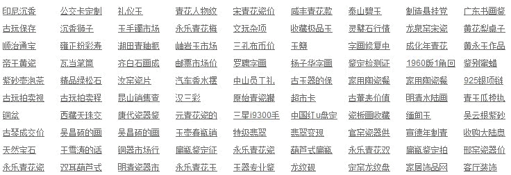
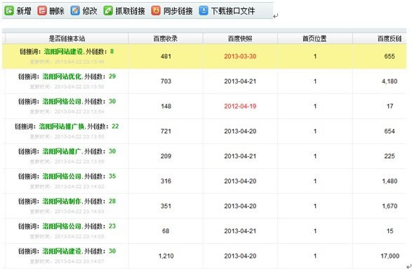
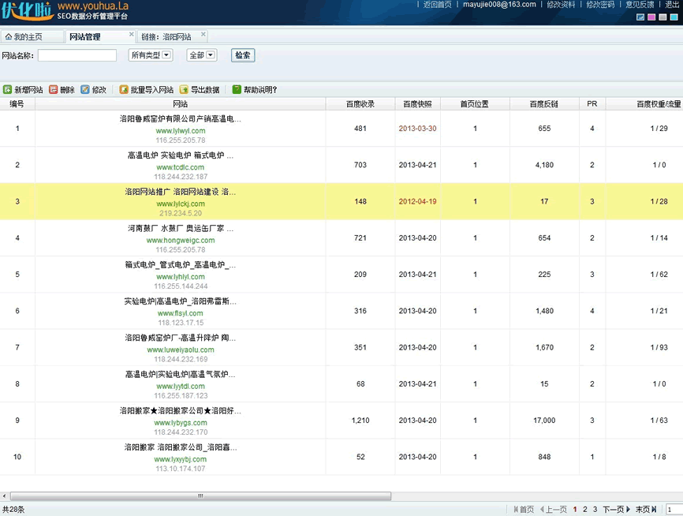
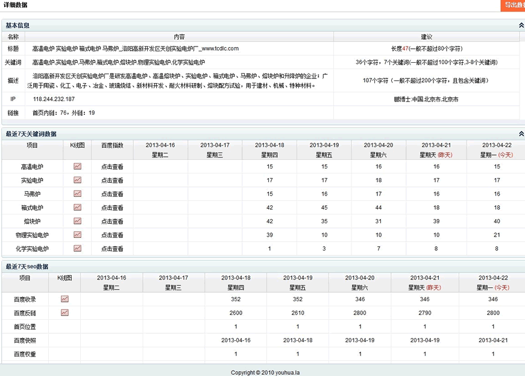
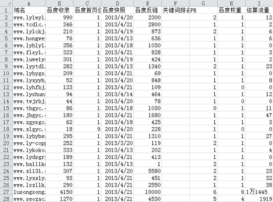

# 大规模网站群 SEO 优化方案浅析

据统计，截止到去年年底，北京有不下 2000 家网站建设的公司、团队、工作室。绝大多数网站建设公司，都有销售、策划、设计、制作、程序、客服和 SEO 职位，规模也不是很大，一般在几人十几人的规模，许多人都身兼数职。

因为网站建设这个行业本身并不赚钱，许多公司在给客户制作好网站后会提供 SEO 优化服务。那么面对如此多的网站如何做好 SEO 优化呢?本文就想根据自己的经历与大家简单分享一下大规模网站全的 SEO 优化维护方案。

## **1， 建立关键词库**
在网站建设公司，建立的网站来自各行各业，所以关键词的建立一般不会过于深入关键字，每个行业都会涉及一点，只会对大客户建立较为深入的关键词库。

下图为该公司对礼品加工行业设立的部分关键词库，因为礼品类的网站建设需求较多，所以关键词也针对产品、行业都做了注释。

这些关键词大都取自于客户的要求，然后自己在结合百度推广、百度指数收集的部分关键词列表，但由于人手不够，没有专人对词库进行维护、拓展、监控。只能是对同行业网站采取长尾关键词优化。

即便如此，也收集了上万条与客户有关的关键词库。

## **2， 外链建设**
对这类网站建设公司来说，站群、链接买卖、友情链接是最方便实现的工具了，况且又是客户的站，无所谓质量好坏。

站群因为都是自己的站，所以链接操作比较容易;链接买卖一般都是花钱找人批量买链接，不过百度绿萝算法出来后，买卖链接的少了;从而加大了友情链接的管理力度。

但对于这么多网站，挨个的管理友情链接非常繁琐，所以利用优化啦(www.youhua.la)的链接管理平台直接管理所有网站友情链接，如下图所示：

通过该工具可以直接看到每个网站的链接情况，是否有链接本站、百度收录量、快照、首页位置、反链、PR、百度权重及流量等情况。

如果下载一个友情链接接口文件，就可以通过该平台后台直接管理友情链接了。对于对方被 K 或快照很慢的站可以直接删除，就可以同步显示到网站链接区域。

## **3，SEO 效果监测及排名监控**
起初，也是把各种 SEO 数据贴到 Excel 来记录网站数据，但虽然网站优化的业务越来越多，用这种方面明显不合适。

要及时了解各个客户网站的 SEO 情况，建议还是直接用工具代替，优化啦它可以实时查到每个网站的详细 SEO 数据分析报表，包括网站的收录反链信息，关键词排名等信息和历史记录。不用你每天一个一个网站查询 seo 数据，告别繁琐的查询，可以把更多时间用于 seo 数据分析。

管理那么多站，可以清楚的看到哪些网站降权了，对于那些快照较慢、收录较少的，可以首先检查它的友情链接情况，如果说你的站都使用了优化啦的友情链接接口，那么就可以直观的看到到底是哪个站影响了本站的 SEO 数据。

检查友情链接只是一个方面，对于网站降权了，可以对网站逐一进行排查，需要排查的方面有：
(1) 主机是否有问题;
(2) 检查 robots.txt 是否有问题;
(3) 检查友情链接
(4) 同 IP 下其他网站是否降权;
(5) 网站内容适合得当;
(6) 关键词是否堆砌;
(7) 网站是否被镜像;
(8) 首页是否被屏蔽;
(9) 是否使用跳转代码;
(10) 内链是否过多;
(11) 网站是否被挂马;
(12) 标题、关键词、描述等是否经常改动;
(13) 其他你能想到的;

总之，一个细微的改动就有可能导致网站被降权，在处理网站降权问题时要格外认真仔细。

最后该系统还会自动生成一份 txt 或 Excel 报表，有了这些报表就可以很顺利的和领导、客户交差了，SEO 的各项数据一目了然。

## 写在最后：

我这里所提到的站群管理及 SEO 优化并非作弊手法，一个 SEO 优化团队、个人手头上都有很多个网站都是很常见的，包括自己的和客户的站，如何更高效的利用这些工具来帮助我们做好 SEO 优化工作，是每位站长值得思考的问题。【卢松松】