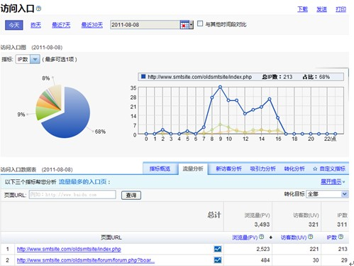

# 网站分析

## 一、网站分析是什么
网站分析是指在获得网站访问量等基本数据情况下，分析网站数据，从中发现访客访问网站的规律和特点，并将这些规律与网络营销策略等相结合，从而发现目前网络营销活动和运营中可能存在的问题和机遇，并为进一步修正或重新制定策略提供依据。

## 二、网站分析意义
网站分析需要对站内站外一系列数据的对分、分析和验证来指导网站监控流量、吸引流量、保留流量，并利用流量完成转化等目标，带来的实际收益主要包括以下几点：

### **监控网站运营状态**
网站分析最基本的应用就是监控网站的运营状态。收集网站日常产生的各类数据，包括浏览和访客数据等，并通过统计这些数据生成网站分析报表，对网站的运营状态进行系统地展现。从浏览数据的变化趋势，到比较新老用户比率等，数据帮助运营者从多角度观察网站的状况是否良好。

### **提升网站推广效果**
常见网站推广方式主要包括 SEO（Search Engine Optimization，搜索引擎优化），SEM（Search Engine Marketing 搜索引擎营销）和广告投放推广。SEO 分析主要是分析网站在各搜索引擎的搜索词排名和点击，以及网站在搜索引擎的收录、排名和展现情况。SEM 分析是通过了解从搜索引擎商业推广结果页导入的流量后续表现，进而调整网页在搜索结果页上排名，针对搜索引擎用户展开营销活动。另外，网站分析可以定制化地细分来源和访客，从而进行有针对性的广告推广营销。

### **优化网站结构和体验**
通过分析网站的转化路径，定位访客流失环节，有针对地查漏补缺，后续通过热力图等工具有效地分析点击分布和细分点击属性，摸清访客的常规行为和人口学属性，提升网站吸引力和易用性。

## 三、流量统计原理
流量统计原理主要有两种：传统的基于日志文件统计和当前较为流行的基于脚本（JavaScript 等）统计。

### **基于日志文件的统计**
通过分析网站后台的日志文件来统计访客的浏览和点击行为。这种方法的优点是简单方便，无需修改网页代码，可以收集网络爬虫数据等。缺点是网站日志包含所有日志数据，需预处理来提升数据质量；而且无法统计到页面缓存导致的缓存浏览数据。

### **基于脚本的统计**
此方法需要在网站的 html 代码中嵌入一段脚本（JavaScript 等）用于统计访客的浏览等行为。这种方法的优点是技术难度低，只需嵌入脚本代码，无需配置服务器；能够快速获取点击、响应等数据并方便展现；不需要担心缓存带来的影响，数据的准确度较高。缺点主要是无法统计网络爬虫的信息。当前主流的流量分析系统绝大部分采用此种方法收集数据，包括百度统计和谷歌分析等。以下为网站分析工具的 JavaScript 收集数据流程图：

## 四、网站分析指标
网站分析中都用到哪些衡量指标？又如何分析这些指标呢？举个例子来说明，如果把一个网站比作一家超市，运营网站就像打理超市的生意，那么目标就是让访客多停留、多购买、多办几张会员卡。为了达成这个目标，我们先要了解当前的情况，比如有多少人走进了超市、看了多少件产品、多少人办理了会员卡；类似地，在网站分析中我们也要了解这些数据，并作为后续业务调整的依据：比如，多少人进入了网站、浏览了多少页面、多少人办理会员等，网站分析指标是数据化地呈现网站运营的状况，帮助站长从各维度了解访客，优化网站。

常见指标为：浏览量（PV）、访问次数、访客数（UV）、新访客数、新访客比率、IP、跳出率、平均访问时长、平均访问页数、转化次数、转化率。可以概况为 3 类，流量数量指标，流量质量指标，流量转化指标。

### 流量数量指标
**1.浏览量（PV）**
定义：页面浏览量即为 PV(Page View)，用户每打开一个页面就被记录 1 次。
技术说明：一个 PV 即电脑从网站下载一个页面的一次请求。当页面上的 JS 文件加载后，统计系统才会统计到这个页面的浏览行为，有如下情况需注意：1.用户多次打开同一页面，浏览量值累计。2.如果客户端已经有该缓冲的文档，甚至无论是不是真的有这个页面（比如 JavaScript 生成的一些脚本功能），都可能记录为一个 PV。但是如果利用网站后台日志进行分析，因为缓存页面可能直接显示而不经过服务器请求，那么不会记录为一个 PV。
涵义：PV 越多越说明该页面被浏览的越多。PV 之于网站，就像收视率之于电视，已成为评估网站表现的基本尺度。

**2.访问次数**
定义：访问次数即 Visit，访客在网站上的会话(Session)次数，一次会话过程中可能浏览多个页面。
技术说明：如果访客连续 30 分钟内没有重新打开和刷新网站的网页，或者访客关闭了浏览器，则当访客下次访问您的网站时，访问次数加 1。反之，访客离开后半小时内再返回，则算同一个访次，以上对访客的判断均以 Cookie 为准。
涵义：页面浏览量（PV）是以页面角度衡量加载次数的统计指标，而访问次数（Visit）则是访客角度衡量访问的分析指标。如果网站的用户黏性足够好，同一用户一天中多次登录网站，那么访问次数就会明显大于访客数。

**3.访客数（UV）**
定义：访客数（UV）即唯一访客数，一天之内网站的独立访客数(以 Cookie 为依据)，一天内同一访客多次访问网站只计算 1 个访客。
技术说明：当客户端第一次访问某个网站服务器的时候，网站服务器会给这个客户端的电脑发一个 Cookie，记录访问服务器的信息。当下一次再访问服务器的时候，服务器就可以直接找到上一次它放进去的这个 Cookie，如果一段时间内，服务器发现两个访次对应的 Cookie 编号一样，那么这些访次一定就是来自一个 UV 了。
涵义：唯一访客数（UV）是访客维度看访客到达网站的数量。

**4.新访客数**
定义：一天的独立访客中，历史第一次访问网站的访客数。
涵义：新访客数可以衡量营销活动开发新用户的效果。

**5.新访客比率**
定义：新访客比率=新访客数/访客数。即一天中新访客数占总访客数的比例。
涵义：整体访客数不断增加，并且其中的新访客比例较高，能表现网站运营在不断进步。就像人体的血液循环一样，有新鲜的血液不断补充进来，充满活力。

**6.IP 数**
定义：一天之内，访问网站的不同独立 IP 个数加和。其中同一 IP 无论访问了几个页面，独立 IP 数均为 1。
涵义：从 IP 数的角度衡量网站的流量。

### 流量质量指标
**1.跳出率**
定义：只浏览了一个页面便离开了网站的访问次数占总的访问次数的百分比，即只浏览了一个页面的访问次数 / 全部的访问次数汇总。
涵义：跳出率是非常重要的访客黏性指标，它显示了访客对网站的兴趣程度：跳出率越低说明流量质量越好，访客对网站的内容越感兴趣，这些访客越可能是网站的有效用户、忠实用户。该指标也可以衡量网络营销的效果，指出有多少访客被网络营销吸引到宣传产品页或网站上之后，又流失掉了，可以说就是煮熟的鸭子飞了。比如，网站在某媒体上打广告推广，分析从这个推广来源进入的访客指标，其跳出率可以反映出选择这个媒体是否合适，广告语的撰写是否优秀，以及网站入口页的设计是否用户体验良好。

**2.平均访问时长**
定义：平均每次访问在网站上的停留时长，即平均访问时长等于总访问时长与访问次数的比值。
涵义：平均访问时间越长则说明访客停留在网页上的时间越长：如果用户对网站的内容不感兴趣，则会较快关闭网页，那么平均访问时长就短；如果用户对网站的内容很感兴趣，在网站停留了很长时间，平均访问时长就长。

**3.平均访问页数**
定义：平均每次访问浏览的页面数量，平均访问页数=浏览量/访问次数。
涵义：平均访问页数多说明访客对网站兴趣越大。而浏览信息多也使得访客对网站更加了解，这对网站市场信息的传递，品牌印象的生成，以至于将来的销售促进都是有好处的。一般来说，会将平均访问页数和平均访问时长这两个指标放在一起分析，进而衡量网站的用户体验情况。

### 流量转化指标
**1.转化次数**
定义：访客到达转化目标页面，或完成网站运营者期望其完成动作的次数。
涵义：转化就是访客做了任意一项网站管理者希望访客做的事。与网站运营者期望达到的推广目的和效果有关。

**2.转化率**
定义：转化率=转化次数/访问次数。
涵义：转化率即访问转化的效率，数值越高说明越多的访次完成了网站运营者希望访客进行的操作。

## 网站分析指标案例说明
如下图是一个访客进入网站的访问行为记录，可以统计到如下指标数据:

统计数据：
浏览量=4
访客数=1
访问次数=2
平均访问时长=5 分钟平均访问页数=2
跳出率=50%
如果 C 是设置的转化目标页面，则转化次数为 1，转化率=50%

## 五、网站分析流程
网站分析流程其实就是一个发现问题、分析问题和解决问题的过程。利用规范的分析流程会避免逻辑混乱，更加清晰和有效地优化网站。以下是总结出来的网站分析流程供大家参考：

### **明确目标 制定计划**
哲学上有三个问题：“我是谁？我从何处来？我要到哪里？”网站分析第一步也有三个问题需要好好思考：“网站的现状如何？网站的是如何发展起来的？网站的发展目标是什么？”首先，对网站现状必须有客观的认识，有多少资源，达到了什么规模，访客积累的程度如何等。其次，对网站的发展历程总结，能更有针对性地规避风险，寻找机会。最后，也是最重要的，是要明晰网站未来发展的目标，一般来说网站的远景目标有以下几点：

1.卖货赚钱：直接增加网站的盈利能力，如京东等电子商务网站
2.推广品牌：增加网站作为媒体的品牌影响力，如新浪网等网络媒体
3.流量合作：服务网民或者给其他网站导入流量，如一些小说导航网站等。

上述远景目标为发展方向，还要将其明确成具体目标，比如电子商务网站需要关注提升销售额和/或降低成本，网络媒体关注提升用户黏性和/或吸引更多的访客来访。在实际操作层面还需要进一步把具体目标落实到指标层面，这样才可以量化评估，推进到实际操作中去。比如电子商务网站进一步关注的指标是“平均每个订单的销售额”和“广告投放成本”，网络媒体进一步关注的指标是“PV”、“UV”等。结合网站内外部情况，预计网站未来的发展，细分维度，制定合理的 KPI（Key Performance Indicator），即上述关注指标到怎么的数值才算达到目标，所以 KPI 就像标杆一样丈量网站进步的情况，是否达到预定目标参照到达 KPI 的标准，让网站运营的方向更加明晰，让网站更高效地达到目标。
　
### **选择系统 部署网站**
这个环节是网站数据分析实践的开始，是收集和获取数据的过程，需要选择合适的网站分析系统来满足分析计划的需求，仅从满足网站分析基础需求角度举出以下几点供大家参考：

**部署简单**
尽量选择部署方便的网站分析系统，特别是中小网站技术人员不多的情况下，最好选用通用代码安装，即全站安装代码一样，无须针对转化跟踪等功能调整代码，也有益于提升后续实施复杂网站分析的可扩展性。

**数据全面**
虽然网站分析者最关注的就是根据网站目标推理出的 KPI 指标，但全面的指标更能帮助站长了解网站的情况，而且要关注该系统中指标是如何定义的，是不是自己想要的；另外，类似访问次数（Visit）这样重要的基础指标是不是全部报告中都具备，不要后续因为某个或某几个指标的缺失而更换流量分析系统。

**功能完备**
网站分析的对象主要包括流量来源、网站访客和网站内容，针对这些对象，流量分析系统需要有相应的报告，方便快捷地提供数据。另外，高实时性非常有必要，即能实时地了解到几分钟甚至几秒钟之前流量和具体到访客的变化，尤其是考虑中国互联网环境的复杂特点，需要快速地掌握流量的突增和突降，迅速地找到问题并修正。最后，网站分析需要精确地了解访客每个点击行为从而更高效地分析访客的意图，热力图（Heat Map）和链接点击图（In-Page Analytics）这样的图形化分析报告解决该类问题的利器。

**运行稳定**
因为收集整理网站的历史数据对今后的数据分析极其重要，在选择时要慎重。所以建议选择大型的流量分析系统提供商，他们会稳定长期地提供网站数据统计分析服务；另外，建议选择服务器规模大而且地址在国内的服务商，否则在收集和传输过程中数据丢包会导致统计数据质量大大降低，参考价值有限。

如上部署即是做好收集数据的预处理工作，获得完整、真实、准确的数据是后续分析工作的前提。另外，对于一些和网站业务紧密相关的分析工作需要提前在系统中进行设置，比如转化目标跟踪等，就需要明确访客到达哪一个或者哪一些页面是转化成功。最后，任何流量分析系统都只是一种工具，还需要网站分析方法论的理论指导，正确地应用到实际工作中去。

**测量指标 分析现象**
搭建系统成功就能获得完整、真实、准确的数据，接下来就是对统计数据进行分析，与流程第一步设定的 KPI 目标进行比较，找到问题。通常说的分析本质上是透过现象看本质，在网站分析中则是从字面上的数据中找到网站本质上的问题。所以，在分析过程中要注意思路和方法，思路包括细分和趋势分析等，方法则更需有针对性，包括 SEO 分析等，这些方法论详见后叙。另外，如果爱都不是几滴眼泪几封情书，那么分析结果也不是几张数据表几个趋势图--对数据的简单统计描述还远远不够，最后一定要归纳和总结问题。

**改进业务 跟踪问题**
分析指标，发现问题之后，下一步解决方案也要梳理清楚：问题有没有解决方案，有哪几种，每个方案的优缺点都是什么，如何落实。此处是网站分析最关键的环节，一定要把分析落实。所有的解决方案可能未必都能立即实现，可以是性价比不合适，可以是没必要，可以是风险太大，可以是收益不明确，不过一定至少要把原因搞清楚，等到时机成熟在启动整改。另外，还要注意监控改进的结果：网站出问题了就像人生病了，现成的改进方案很可能只是在做手术，更重要的是手术后病情观察和会诊，甚至继续再做几次手术。比如网站的流量一直持续下跌，可以选择马上买来流量或者搞推广活动吸引流量进来，不过这些大多只能短期提升，后续还需要不断提升网站本身的内容质量和用户体验来长期保持访客群体的数量和质量。

## 六、网站分析思路

### 网站分析思路综述
很多人开始进行网站分析时候都感觉没有思路，不知道从那种角度看数据。以下将会先简述总体分析思路，再较为详尽地和大家介绍下最为常用的趋势和细分分析思路。总体的网站分析思路可以总结为简单八个字：“微观监控、宏观调控”：

**微观监控**
微观监控是指对一些关键的实时更新数据监控要细致、全面，不能遗漏重要点，防微杜渐，比如刚刚购买了某个推广渠道的流量，要特别关注这个渠道流量的变化，防止流量作弊；类似地，这种计划外的流量变化监控要全面和及时，把运营风险降到最低。

**宏观调控**
宏观调控是指观测网站的整体流量，结合内外部数据（本网站历史数据和竞争对手情况）进行分析，从而制定出较为长期的改进方向，并在后续的操作中结合实际情况具体实施。

举个例子，中央政府发现国家投资过旺，而消费不足（整体掌控），长久下去不利于 GDP 的健康增长，于是提出“扩大内需”的指导思想（结合数据分析）；虽然“扩大内需”不具有直接的操作性，也不是马上就能操作的（长远调整），但是地方政府领会之后会结合自身的特点，提出并执行适合当地情况的具体可行方案（结合实际情况具体落实）：比如四川发熊猫卡，让大家去旅游；比如山东把家电超市搬到农村去卖等等；而中央政府也会把好的经验进行总结，有推广价值的会全国推广，如此良性循环。换位网站分析的工作，我们可以先了解整个网站流量的变化，再细分分析多个子频道的流量变化情况，由于每个子频道的特点不尽相同，可以在综合分析数据增长或者下降后，有针对性地提出推广活动吸引流量或者美化页面视觉效果等的整改方案，并在后续的操作中不断调整。

因此，在所管理的网站数据范围内（整个网站或某个子频道），网站分析者就像公司的老板，网站分析系统就像是公司里的业务员，许许多多业务员将信息采集上来，做出一定的加工并呈现给老板，老板要做的就只有“微观监控、宏观调控”。

### 细分分析--从表象到本质
网站分析的对象主要包括：**流量来源**、**网站内容**、**网站访客**。

**流量来源**：流量是网站的重要资源，流量来源可以分为：直接访问、搜索引擎、外部链接这基本的三个类，其中每个类别还可以继续细分，如搜索引擎可以细分为百度、谷歌等。针对上述某类或者某个来源做细分分析，找到原因并改进或优化。

**网站内容**：一般来说，网站可以分为几个子频道，每个子频道又可以由许许多多页面构成的，网站的子频道和具体页面承载的内容和针对的访客都有所不同，站长分析网站流量就要更有针对性地选择页面进行分析。

**网站访客**：网站访客的指标数据（UV、IP）背后都是活生生的互联网使用者，他们有着不同的分析属性（新/老访客、地域）和人口学属性（性别、年龄、学历等）；带着不同的目的，从不同的来源进入，访问轨迹也不同，在分析中要细分符合市场定位的访客，做定向的对比研究。如下图即是访问过网站的每个访客的基本情况，包括地域、来源、上站时间和访问页数等。

以上这些都是网站分析要研究的，在数据中能发现问题和机遇的线索，而细分分析则可以帮助网站管理者有效地定位具体问题，确定了具体的方向才能有的放矢地解决问题。这个过程常常就像剥洋葱皮一样，一点点接近问题的本质，虽然可能要痛苦地流泪，但结果往往是很有价值的。

**如何做细分分析**
在了解网站运营状况的前提下，对上述的来源、访客、内容等进行细分，可以逐步地定位问题或者找到机会。

例如，有一家小网站想要在北京地区做推广工作，笔者对其按照以下步骤进行细分，这样更好地了解该地区访客的访问习惯，让工作更有针对性。

如图所示，在百度统计的【受访页面】报告中对网页的访问情况进行筛选：
1.筛选地域，过滤出【省市自治区】（还可以过滤出全国、国外等）
2.筛选来源，过滤出【搜索引擎】（还可以过滤出直接访问、外部链接等）
3.筛选搜索引擎，过滤出【百度】（还可以过滤出谷歌、搜狗等）

当在过滤栏里精挑细选要关注的交叉维度后，系统在下方的【受访页面数据表】里就会提供页面 URL 的各个指标，精确地把数据呈现出来方便分析。比如下图所示如下图所示： 其中第一个链接为网站首页，我们就可以了解到通过百度搜索引擎的新访客达到网站首页后的表现，如带来 pv 为 178，平均停留时长为 00:02:29，退出率为 82.12%.

4、用户群细分：

而对于自身定义的用户群等属性的细分，我们推荐使用百度统计的 js api,利用百度统计的自定义变量（_setCustomVar）可以做访客、访次和页面级别的自定义用户属性。语法：_hmt.push(['_setCustomVar', index, name, value, opt_scope]); 如：_hmt.push(['_setCustomVar', 1, 'login', '1', 2]);其中 opt_scope 可选自定义变量的作用范围分为三种：1 为访客级别（对该访客始终有效）、2 为访次级别（在当前访次内生效）、3 为页面级别（仅在当前页面生效），默认为 3。

上述的每一个级别都对应了一个作用范围，每一个自定义变量都是限制在某个范围内的。

在需要对不同类别的访客今后的一系列行为做区分筛选的时候建议使用访客级别，比如“否是 VIP 会员”等标签；

在需要对本访次的用户行为或状态做区分筛选的时候建议使用访次级别，比如“是否登陆”等标签；

在需要对本访次的访问内容或访问路径做区分筛选的建议使用页面级别，比如看了“体育频道”还是“财经频道”等标签

### 趋势分析--有比较才有进步
为什么要趋势分析
如上文中谈到的，网站的进步体现在指标提升，网站的问题体现在指标下降。流量分析系统常常将这些数据在时间维度上展现成趋势。我们需要为关注的指标设定参考值，通过这些参照和比较来了解网站的目前运营情况以及同预期目标的距离。

如何做趋势分析
当前所谓的趋势分析，即是基于时间序列的数据趋势分析，主要以同比、环比、定基比为具体的分析手段。为了能让大家更好地理解后续的分析思路，现名词解释如下：

**时间序列**：指将某种现象某一个统计指标在不同时间上的各个数值，按时间先后顺序排列而形成的序列。在流量分析系统中通常可以选择一段时间呈现指标数据的连续变化情况。

**同比**：为了消除数据周期性波动（季节等）的影响，将本周期内的数据与之前周期中相同时间点的数据进行比较。例如今年第 n 月与去年第 n 月比。

**环比**：指的是将本期的数据与前期的数据进行比较，反应的是数据连续变化的趋势可以是日环比、月环比、周环比等，例如今年第 n 月与第 n-1 月或第 n+1 月比。

**定基比**：将所有的数据都与某个基准线的数据进行对比。通常这个基准线是公司或者产品发展里程碑，将之后的一段时期内的数据与这个基准线进行比较，从而反映公司在里程碑后这段时期的发展状况。

以下举例说明，在百度统计中登录后的概况页面就有便捷地同比和环比对比：

**环比**：上方数据表显示的今天与昨天的各个指标数据对比

**同比**：下方的折线图显示的是今天每小时数据与上周的同一天的各个指标对比

**另外**，在【趋势报告】等带有时间控件的报告中可以选择任意两天的数据比较，依据网站实际业务指定基准线，划定时间范围，选择观察指标的变化情况。

最后，基于时间序列的趋势分析方法还有很多，其中同比和环比是最简单易用的，网站分析中大多数的常见数据分析均可以用如上思路快速观察关键指标的变化情况，了解现状，衡量达成目标的进度。

## 七、网站分析方法

### 1、流量引入分析和优化--提升网站引入流量的数量和质量
为什么要做网站呢？为了赚钱（电子商务和广告媒体），为了出名（打品牌），为了兴趣（个人博客等），为了帮助大家（公益网站）。如果要达成以上目的，必须要引入流量，那么流量是从哪里来的呢？从站外进入的流量来源可以分为三种：搜索引擎、外部链接、直接访问，网站分析中的流量引入分析即是分析这些来源流量的数量和质量。

那现在提一些问题看大家是否都关注过：
1.搜索引擎收录页面的准确值你知道吗？
2.辛辛苦苦做 SEO（search engine optimization,简称 SEO）的效果如何？怎么改进呢？
3.购买的许多推广链接流量，哪些才是“链”有所值的？
4.流量分析系统里“直接访问”来源的就只是直接输入域名访问网站吗?

以下会分别对搜索引擎、外部链接、直接访问等来源的流量介绍分析手段和优化方法，其中也会大家一起讨论上面那些问题。

**为什么做搜索引擎流量分析和优化**
在当前互联网体系中，一般来说搜索引擎是给大多数网站带来的访客是最多的。所以如果想使网站获得更多流量，那就得先让搜索引擎找到网站，收录更多页面，也就是让网站在搜索引擎里有更多的曝光率，网民后续点击进入网站的机会更多。

**如何做搜索引擎流量来源流量分析**
当前在中文搜索引擎产品中，百度占有绝大部分市场份额，本白皮书将会侧重于介绍百度搜索引擎的分析和优化方法。搜索引擎流量可以分为两种：自然搜索结果被点击产生的免费流量，针对的优化方法是 SEO；另外就是商业推广结果被点击产品的付费流量，针对的优化方法是 SEM。可能有的站长朋友对此二者的排名关系有疑惑，在此引用《百度互联网创业者俱乐部搜索引擎优化指南》中的官方说明：“百度的商业推广和自然搜索，是由完全独立的两个部门分别运营两套独立系统，参加商业推广的网站，在自然结果中一视同仁，没有任何特殊处理。百度的商业推广（包括左侧和右侧）和自然搜索（从前的特征是后面带一个链接，叫百度快照；但现在大部分的开放搜索结果也是不带快照链接的）是两个完全独立的系统。商业推广的原理，不是【给了钱，自然结果中的某些结果就可以排得更靠前】，而是【用户的关键词被分发到两个独立系统中，分别产生了商业结果和自然结果，商业结果在前，自然结果在后，就构成了百度的搜索结果】。”由于搜索引擎的商业推广和 SEM 自成一套成熟体系，本白皮书仅针对通用的网站分析作以介绍，SEM 相关操作会在后续升级版本中提供。

具体分析方法是：先了解并分析搜索引擎总流量，再细分每个搜索引擎流量，最后细分重要的搜索词带来流量。（注：本文所述的搜索词是指网民为找到需要的信息在搜索框中输入的词语；关键词是指搜索引擎商业推广账户中购买的词语。）

**搜索引擎流量分析**
先了解搜索引擎作为一个来源在总来源流量中的情况，并做趋势分析.
在百度统计中的【全部来源】中了解全流量占比：

在【搜索引擎】报告中查看细分流量，有针对性地分析某个或者某几个搜索引擎的表现：了解不同搜索引擎给您网站带来的流量情况。根据各搜索引擎给网站带来的流量数据，可以及时了解到哪种搜索引擎能够给网站带来更多访客，以及哪种搜索引擎带来的访客更关注网站的内容，后续可以将更多推广预算或者 SEO 资源分配到能够给网站带来更多访客且访客关注度更高的搜索引擎；对于带来较少访客或者访客关注度不高的搜索引擎，可以结合业务背景进一步分析原因，并不断提高这些搜索引擎带来的流量及流量质量，以避免盲目地降低推广预算或者 SEO 资源导致潜在访客的流失。

**搜索词流量分析**
仅仅分析到搜索引擎是不够的，需要细化到搜索引擎下面的搜索词带来流量的表现。在【搜索词】报告中给出了在百度、谷歌、搜搜等，及其他搜索引擎之和四部分的比例数据，首先详细了解搜索词在各引擎中的比重；同时注意占比给出了各个搜索词占所有搜索词的访次比重（理解为通过搜索引擎带来了多少访客的比率），可以了解该搜索词对网站流量的影响比重，由于做 SEO 的精力和资源都是有限的，所以后续操作要更有重点。另外根据需要还可以点击列头总搜索次数、百度、谷歌、搜索下方带有下划线的数字，进入查看搜索词的其他数据表现。

那么已经细分到了搜索词的分析，这个词除了带来的 PV、UV 等指标来衡量，还有那些参考呢？在百度统计中提供了每个搜索词的百度指数，百度指数是以百度网页搜索和百度新闻搜索为基础的免费海量数据分析服务，以图形的方式让大家掌握第一手的搜索词趋势信息。具体操作点击搜索词（分搜索引擎）报告搜索词右侧的图标即可，查看百度指数。

除了网站现有的搜索词，还需要了解其他热门搜索词，热门搜索词帮助大家了解用户的搜索习惯，通过更多词优化网站收录。在百度统计中点击搜索词（分搜索引擎）报告搜索词右侧的“词”图标来查看查看到与该词最相关的 10 个热门搜索词；搜索词后的条形图表示这个词的热门程度。

最后了解了这些搜索词的情况，建议还要回到这个搜索词被点击的场景下观察，更容易让我们了解网民为什么点击或者不点击这个搜索词，在 SEO 方面可以对应到展现的层面，比如出现的 title 是不是比较吸引点击。在百度统计中的搜索词报告中点击搜索词（分搜索引擎）报告搜索词右侧的“链”图标既可查看搜索来路 URL，即一个搜索词在搜索引擎中的原始搜索页面（点击链接查看），还可以知道这是在第几页的搜索结果，快速了解用户搜索情境做出判断。

**如何做搜索引擎流量来源流量优化（SEO）**
**认清搜索引擎收录量**
SEO 是门比较专业的科目，单独开辟一节来叙述。SEO 操作的前提是先要明确搜索引擎收录量，在百度统计的【搜索引擎】报告中每个搜索引擎名称后面有个“收”字的图标，点击后会跳转到各个搜索引擎查看对应的收录量估算值。

上述除百度外的其他搜索引擎收录量是通过在搜索引擎输入框中输入“site：domain.com”得知的，尤其在百度搜索引擎中是很可能有误差的估算值。在此介绍一下 site 命令的前世今生大家就明白了，其实 site 的产生其实是期望用户可以设定约束搜索范围，实现更加精准的搜索动作，比如下图所示的是查看下“青岛啤酒”这个词在搜索引擎里新浪网站中出现的次数，当然如果不加前面的词也可以估算整个网站的收录量了。

但是，网站分析和优化是建立在数据尽量全面准确的基础上的，仅知道估算值是远远不够的，需要了解精确值才能量化进步或者找到问题。以百度搜索引擎为例，在百度统计中有专门的【百度收录量】报告，在网站所有页面安装百度统计代码，产生流量数据之后，可查询百度收录量数据，大致以周粒度更新，让大家了解用户到底在百度上看到多少页面。

**搜索引擎收录量优化**
了解了自己的网站有多少被收录了，下一步就是提高网站的 SEO 水平。之前百度大搜索部门曾经发布过《百度创业者俱乐部搜索引擎优化指南》，其中对基础的网站 SEO 建设给出了详细的说明，请大家通过百度搜索引擎搜索并下载了解。此方法论现已部分产品化，即作为一个报告出现在百度统计当中--【SEO 建议】：就像当前流行的 360 安全助手给电脑的健康情况打分一样，此报告能对网站的 SEO 情况打分，完全量化 SEO 水平，并且指出那些页面有问题（尤其检查首页等重要页面），有什么问题（缺少 keywords 和 description 的 meta 标签，这可能会对网页的展现和排序产生一定影响），怎么样解决（建议添加信息，让搜索引擎知道这些内容的意思）如图所述：

**搜索词排名**
在 SEO 优化中，除了需要关注页面收录外，还需要关注网站搜索词的在搜索引擎如百度等的排名以及这些词的热度（如百度指数的数据），百度统计提供搜索词排名功能。包括搜索词的搜索词排名、百度指数、搜索词带来的 pv、uv、跳出率和平均访问时长，有助你监控和优化网站搜索引擎数据。

最后，再和大家聊聊 SEO 的核心意义：搜索引擎优化是按照搜索引擎给出的优化建议，以增强网站核心价值为目标，从网站结构、内容建设方案、用户互动传播等角度进行合理规划，以改善网站在搜索引擎中的表现，吸引更多搜索引擎用户访问网站。也就是说百度认为 SEO 与搜索引擎是互相促进，互利互助的。因此实施 SEO 的原则是不要仅仅着眼于把流量引入到网站中，还要优化网站方方面面，从搜索引擎获取流量的最终目的是不断提高网站的核心价值。从搜索引擎获得的流量，有多少能转化为网站的核心价值，可用转化率来度量，每个类型的网站核心价值不一样：
1.网络媒体型的内容网站，忠实用户是核心价值，把搜索引擎用户转变为忠实用户就是最终目的；
2.社交（SNS）网站，注册用户和活跃用户是核心价值，让用户来你平台注册、活动就是最终目的；
3.电子商务网站，访客买卖东西就是核心价值，把东西卖给顾客就是网站运营要达到的目的。

**外部链接流量分析和优化**
**为什么做外部链接流量分析和优化**
除了搜索引擎，还有很多站外链接给网站带来流量，这些都称之为外部链接来源流量。站长需要及时了解哪些非搜索引擎类网站给您网站带来了更多更优质的有效访客，从而科学规划内容推广渠道。

**如何做直接访问流量分析和优化**
首先应该能正确地区分出直接访问，全站安装统计代码，另外要针对站外广告来源都定制化标记。访客在浏览器地址栏中直接输入网址产生的流量是网站分析首要关注的：这类直接流量的入口页大部分都应该是网站的首页。因为首页的域名是整个网站中最短的 URL。一般来说，现在的访客难以记住一个看上去并不那么好记忆的 URL，而且还有手动输入浏览器地址栏进行访问。如果真是如此，那网站的域名或者子域名是最为合理的。所以，直接流量中部分流量如果比较大，而且入口页不是网站首页，则这部分流量大多数都不是访客直接输入网址产生的流量，建议找到原因，把这部分流量的来源监控起来。

### 2、流量变现分析--帮助网站把流量变成更多的钱

流量变现就是把网站的流量变成现金，现在互联网最常见的流量变现模式就是电子商务和售卖广告：DCCI 发布的《2011 中国站长调查暨互联网生态报告》调研结果显示，当前站长最多选择的盈利模式是网络媒体售卖广告（68.3%），其次是电子商务销售产品（29.8%）。在此介绍下如何通过网站分析和优化帮助网站更高效地把流量变成现金。

电子商务模式较为复杂，到一定规模后还要花费配置后台和仓储结算系统；售卖广告就更加常见，尤其是网站参加各种流量广告联盟更加方便变现。笔者曾了解过一些售卖广告位的站长是这样通过分析数据指导运营的：只看 PV 和 UV 两个数据，计算下 PV 除 UV 的比率，代表每个访客看的大致页数，如果比率降低了则减少各种广告的投放打扰，让访客多看几页，增加黏性；比率提高了则多投放点广告赚钱。这个机制虽然简单，甚至可以称为简陋，但确实在实际应用中一定程度上论证了访客黏性和广告点击量的因果关系，也就是是越多的访客来到网站上浏览了越多的页面（或访问时长足够长），广告被点击的可能性就越大，因此我们从网站分析的角度提升广告收入可以考虑调整网站内容和结构增加访客黏性；其次，还可以考虑分析网站访客的属性，依靠内容或推广方式吸引广告的受众人群。以上思路还是不够精细的，以下就先以网络媒体售卖广告为典型，侧重介绍优化整体网站流量变现，包括入口页分析等一些基本分析和优化方法。

电子商务网站流量变成现金的机制相对更加清晰，就是在流量引入后让更多的访客有比较多的消费，即流量直接转化为现金；而同时有一点要注意的是电商网站获取用户的成本比较高昂，大部分网站都需要购买广告位来吸引流量，此时推广的费用也要计算在成本之中，因此总得来说是要提升每个订单的平均消费金额，降低平均转化成本，在介绍完上述通用性较强的整体网站流量变现后，后续以电子商务销售产品为典型，侧重介绍优化转化相关分析和优化方法。

**受访页面分析**
**为什么做受访页面分析和优化**

网站的内容是其具体价值之一，内容依靠页面承载，访客到网站不全是看网站的名气和品牌，更多地还是针对网站上的内容和服务，所以站长通过分析不同类型的页面来分析网站并不断优化提升。受访页面从访问顺序维度可分为入口页和退出页，后续章节会针对二者的特点分别介绍，本节仅从普适的受访页面维度介绍分析方法。

入口页：又称着陆页（Landing page），是从外部（访客点击站外广告、搜索结果页链接或者其他网站上的链接）访问到网站的第一个入口，即每个访问的第一个受访页面。
退出页：在本网站这次访问的终点页面，即每个访问的最后一个受访页面。

**如何做受访页面分析**
在百度统计中有专门的【受访页面】报告，在数据表的右上方有多 tab 设计帮助站长迅速切换做“页面价值分析”、“入口页分析”、“退出页分析”，此节主要介绍第一点：

先介绍如何评判相关指标在分析页面价值维度中的作用：
贡献下游浏览量：助你了解该页面对全站 PV 的贡献，越高说明其对其他页面的 PV 输血能力越强。（该页给本站其他页（包括跨域站点）带去浏览量的总和，即为贡献给下游浏览量。需要统计点击 referrer 计算带去的浏览量，直接的 PV 贡献。举例来说：网站首页(<http://www.abc.com/>)给网站内页带去了 100 个 PV，则 www.abc.com <http://www.abc.com/>的“贡献下游浏览量”为 100）

平均停留时长：考察了页面黏度，越高说明访客对此页面越关注。

Page View(PV)：用户每打开一个网站页面就被记录 1 次。用户多次打开同一页面，浏览量值累计。

受访页面的 PV 高说明被访问的多，而贡献下游浏览量高说明带给其他后续访问的页面浏览量高。由于网站结构的设计，有些页面的贡献下游浏览量会比较高，比如首页。所以，考察这个指标要更多地针对同类的页面，比如都是资讯类的两个新闻页面，后续都是几个推荐的其他新闻内容，哪个新闻的 PV 较大说明更受欢迎，而贡献下游浏览量较大则说明这个页面的对后续浏览的页面贡献较大。另外贡献下游浏览量较大也说明推荐内容很好地继承了前述页面的访问，能够迎合访问上个页面访客的兴趣，是比较合理的搭配。最后，平均停留时长越长也越能说明访客对此页面关注。结合以上三个指标可以分析页面价值。

**页面分类（子目录）分析**

对于网站页面类型较多，需要对不同类型的页面进行细分分析。如电商网站的首页、列表页面、单品页面、搜索页面、购物步骤页面的相应指标和用户属性均不一样，这时候需要用户对这些页面进行归类分析。百度统计子目录功能提供页面的分类规则，用户任意可以将一组页面归类在一起分析进而可以对比分析不同类型的页面。

**入口页分析**
**为什么做入口页分析和优化**
所谓入口页，又称着陆页（Landing page），是从外部（访客点击您站外广告、搜索结果页链接或者其他网站上的链接）访问到您网站的第一个入口，即每个访问的第一个受访页面。这部分页面对访客后续的访问行为影响很大，甚至是决定性的。访问入口就像是一部电影的开头一样重要，肩负着吸引观众坐下来继续看的重任，这样才有可能给电影打高分。因此我们需要找出对访客最有吸引力的入口页，或者优化当前入口页，使其更有吸引力。另外，访客都是通过入口页进入到网站，尤其对于新访客来说，入口页面网站的第一印象，就像人际交往中第一印象一样重要，值得好好分析新访客最多的入口页。以下将会介绍下如何分析和怎么优化，当然，入口页面对推广和转化也非常重要，鉴于这部分自成体系，在后续转化分析章节介绍。

**如何做入口页分析**
在百度统计中有对应的【访问入口】报告，此报告可以帮助站长分析和优化入口页面。

那怎么分析访问入口报告里的吸引力相关数据呢？首先，从分析页面作为入口页面的角度看下列指标：
1.跳出率：即评估访客对您网站的第一印象，跳出率越高则越多访客看过入口页后选择离开。
2.平均访问时长：是从该入口进入的访客平均每次访问在网站上的停留时长，越高说明其关注时间越长。
3.平均访问页数：是从该入口进入的访客平均每次访问浏览的页面数量，越高说明其关注的页数越多。

另外，新访客是较为特殊的一个群体，他们对网站并不熟悉，需要更加细分了解分析。让我们先看下和新访客相关的指标有哪些：
1.访客数（UV）：为一天之内从该入口进入您网站的独立访客数(以 Cookie 为依据)，一天内同一访客多次访问只计算 1 个。
2.新访客数：从该入口进入的独立访客中历史首次访问您网站的访客数。
3.新访客比率：考察了从该入口抵达的访客中有多少是新访客，越高说明新访客对此入口越有兴趣。

在访问入口报告中可以点击数据表右上方的 tab 快速切换查看这些指标。举个例子：假如你的网站有介绍篮球和足球两个入口页面，本身主题类似。通过访问入口报告中上述吸引力指标，就能看出哪个入口页比较有吸引力：如果在数量上进入篮球入口页开始的访问访客平均访问时长较长，平均访问页数较多；在效率维度上，跳出率（只浏览了一个页面便离开了网站的访问次数占总的访问次数的百分比）较低，则篮球内容的入口页可能对访客更有吸引力。而对于新访客方面则更可能和这个入口页对应的来源更有关系，比如新访客比率较高的入口页的来源可能对新访客更有吸引力，可能说明更加让新访客信服，即使他们从来没有访问过网站的。

**如何做入口页优化**
首先，在优化手段上入口页面设计和内容很大程度上影响访客是不是选择进一步的浏览，或者怎么样浏览。建议提高网站信用度，网站信用度指用户给予你网站的信任程度。用户对网站的信任度是用户在网站上进行活动的基础。建议做到以下几点：
1.页面美观、整洁
2.介绍和口号让访客可以很容易了解网站背景
3.详细的网站介绍、联系方式，方便用户联系网站经营者
4.用户评论、顾客反馈等信息，让老用户影响新用户
5.注重强化网站的品牌，逐步建立并发挥品牌效应

网站的目标在于保持老用户，拓展新用户，所以要保持老用户数量稳定增长的前提下，提升新用户的所占比例。引入流量到入口页的来源当然要好好优化：要注意哪个入口页来的流量中新访客比较多，找到新访客多的原因，并且把先进的经验推广的其他的推广来源。比如访问入口页面 A 的广告 a 带来的新访客数量很大，那就需要进一步看原因了，分析清晰后指导全站的推广工作。

其次，广告和入口页内容要匹配好，不建议内容差距太大，否则访客不会后续访问太多，甚至可能认为这不是他们想要的而离开。比如在广告中出现的图片是“耐克鞋大促销”，进入网站第一个页面却展示了过多产品，甚至令人眼花缭乱的产品库首页，对访客找到他心仪的耐克鞋造成了很大困难。这种情况在指标上的表现就是跳出率会很高，平均访问时长短，平均访问页数少。

**退出页分析**
退出页是在本网站这次访问的终点页面，其中退出页次数这个指标帮助站长了解访客在本网站这次访问的终点在哪些页面（退出页），此数越高越说明你需要了解访客在该页面离开的原因。另外有退出率这个指标值得关注：退出率（Exit Rate）为该页面的退出次数/该页面的 PV 数。比如一个访客通过搜索引擎进入一个电子商务网站，历经登录成功页面、产品库页面、购物车页面、付费成功页面，整个的购买结束离开网站，只是对于最后的付款成功页面来说这是一次退出，但对这个访次历经的其他页面来说并没有退出。所以退出率大小一般直接说明每个页面的内容质量的好坏。注意区别“跳出率”（又称跳失率、蹦失率、Bounce Rate）：用户浏览第一个页面就离开的访问次数占该入口总访问次数的比例。所以跳出率的大小一般只能说明网站入口页（Landing Page）的质量。

受访页面的 PV 高说明被访问的多，退出率则直接说明了每个页面的内容质量的高低。如果一个页面的退出率很高，有两种可能性：访客对页面不感兴趣，没有再点击页面上的其他链接，直接关闭了浏览器窗口结束了访次。另外的可能就是页面上没有链接（或是链接很少），这种情况出现的可能很小。所以如果某个受访页面的退出率高，那么该页面质量有待提高，需要找到离开的具体原因并改正。

在百度统计的受访页面报告中可以切换到“退出页分析”快速查看退出页相关指标指标并分析。

**访客分析**
“访客”这个词背后是一群活生生的网民，每个人都有自己的特点，他们水滴一般聚集成互联网上的洪流--“流量”。

所以，虽然网站分析的任何对象指标都是以流量为表征的，但理解了访客才能理解流量的本质。我们不能真的亲眼见到网站访客，但可以通过分析访客行为数据了解他们的情况和喜好，调整网站的结构和内容，或者精确引入网站的目标人群，更高效地把流量转化现金。

**新老访客分析**
老访客是对网站有相对较高的粘度，是为网站带来价值的忠诚用户；而新用户则是推动网站运营和业务发展的动力。如果把网站比作一个人的话，那网站的老访客是留存血液，新访客则是新鲜血液；必须在大部分血液留存的基础上有新鲜血液不断补充，生理上人才能成长壮大。网站的健康发展模式是老访客不断回访，新访客不断增加。所以要分析老访客来确定网站的现有流量基础是否稳固；分析新用户，来衡量网站的当前发展趋势是否良好。

如前文所述网站运营健康的情况下，老访客数量一般是稳定增长的，所以对老访客的分析要针对老访客数量的同比比较，一方面是由于季节等周期性因素的影响，同比的变化趋势更客观，更有说服力；另一方面，某些时段上的推广活动会吸引大批新访客来到网站稀释老访客所占总访客数的比例，所以要看绝对数量。如果老访客比较稳定，那么就可以根据新访客比例变化趋势分析某段时间的推广效果。

另外，在百度统计中有【新老访客】报告，其中细分了二者来源、访问页面等指标，让站长区分新老访客的不同行为。

**地域分布分析**
在百度统计中提供【地域分布】报告，可以了解来到网站上的访客所在的地域。

不同地域给网站带来的流量不同，这些数据可以辅助合理地分配各地域的推广预算和有针对性地制定业务推广策略：
1.对于已经进行了推广的地域，可以及时地了解在该地域的推广策略是否带来了足够的访客，以及这些访客对网站内容是否足够感兴趣，借助这些信息可以进一步评估在该地域的推广方案的合理性，并且不断地调整与优化。

2. 对于尚未进行广告推广的地域，如果存在流量，说明这些地域有网民在关注网站，可以抓住时机在这些地域进行推广，以便及时地获得更多商机。

**系统环境分析**
在百度统计中提供【系统环境】报告，可以了解来到网站上的访客所使用的系统环境。系统环境包括浏览器、操作系统、屏幕分辨率、屏幕颜色、FLASH 版本、是否支持 JAVA、语言环境、是否支持 Cookie、网络服务提供商等。通过数据可以获得以下信息：
1. 访客在浏览网站时经常使用的是什么系统环境。
2. 使用哪种系统环境的访客在您网站上停留的时间更长或者访问的页面更多。
3. 哪种系统环境是之前网站运营还没有考虑过的。

获得这些信息后，可以更多地从技术功能方面去优化网站，从而进一步提升网站的吸引力及易用性，带来更高的访客转化率。比如现在很多网站在前端开发的时候都认为兼容 IE6 浏览器比较麻烦，而且似乎这么低端的浏览器没有人用才对，就不愿意继续兼容开发了。但决策前请先看下此报告中浏览器到底分布如何再做决定，一般来说 IE6 还是有很多用户使用的，所以要靠数据做决定。

**访客属性分析**
此处包括了访客人口学属性和访客行为属性。在百度统计中有【访客属性】报告展示了访客人口学属性；百度统计通过对您网站页面长期的监测，根据访客的访问行为，判断访客的兴趣爱好，进而描述访客的人口学属性；通过数据可以获得以下一些信息：
1. 您网站访客的结构是什么样的，男女、年龄的分布情况。
2. 发现您网站访客的主要特点，寻找与行业均值的差异。
3. 哪类人群是潜在的受众。

获得这些信息后，可以更多地有针对性的提供内容和制定推广方案。比如某个网站的某个年龄比例超过互联网平均值，那么说明这个网站是偏向于更吸引此年龄阶段的网站，即该网站的目标受众为此年龄阶段的访客，应该针对此年龄阶段进行内容引导；通过此报告还能发现新的目标人群。例如一家婴幼儿用品店，原来制定的目标人群是 20-29 岁的青年夫妇，通过此报告发现 50-59 岁的老年人占比也较高，通过此线索进一步调查发现现在较多爷爷奶奶或外公外婆在照顾小孩，帮家里买婴幼儿用品。可对这个年龄阶段的目标人群提供有针对性的内容和推广创意。

在百度统计中有【忠诚度】报告展示了访客人行为属性，如下：

访客行为属性包括：访问深度和访问页数。（访问深度是指访客在一次访问中浏览了网站内不同页面的数量，反映了访客对网站各个页面的关注程度；访问页数是指访客在一次访问中浏览您网站内页面的总数，如果对同一页面浏览了多次，访问页数也计多次，访问页数反映了访客对网站的总体关注度。通常，可以将这两个指标结合起来看，如果访问页数高，但访问深度低，说明访客集中关注网站上的少数页面；如果访问页数低，但访问深度高，说明访客关注点较分散。建议结合受访页面报告及页面上下游报告，定位访客行为具体原因，从而有针对性地优化网站质量。）

**转化分析**
前面章节叙述了很多通用的分析和优化方法提升网站的访客黏性和品牌，我们再重新审视下做网站的目的：为了赚钱，为了扩大影响力等等，这些目的可以总结成一个个目标，比如多少访客购买了网站内介绍的产品，多少访客下载了网站上的软件，从而衡量预期目标的完成情况，以此了解引入的流量在网站里对目标完成的贡献如何。简而言之，我们需要有相应概念，来描述期望访客完成预期动作的次数，进而衡量网站目标的完成情况，包括数量和比率：

转化次数：访客到达转化目标页面或完成网站经营者期望其完成动作的次数。
转化率：转化次数/访问次数，即访问转化的效率。
后面的内容会多以电子商务网站运营为例，介绍一系列的转化分析和优化方法：

**转化来源分析**
如上述的转化定义，广义地来说转化相应的行动可以是用户登录、用户注册、用户订阅、用户下载、用户购买等一系列用户行为；在实际监控中可以分为两种，页面转化目标和事件转化目标：
页面转化目标是指某个页面作为转化目标，访客到该指定页面后即为转化成功，比如访客到达了最后的购买成功页面。

事件转化目标是相对页面目标而言的，指网页内部的某个可以点击的元素，如链接、按钮等。访客触发了指定的元素后即为转化成功，比如访客点击了“抢购”的按钮。

在百度统计中可以分别在后台设置“页面转化目标”和“事件转化目标”。具体设置方式详见 http://hi.baidu.com/tongji2009/blog/item/992ea40e203a30266159f351.html 和 http://hi.baidu.com/tongji2009/blog/item/d785c3d0cbb189359a502775.html 在全部来源等多个报告均可查看设置成功的转化指标，如下图所示，另外，搜索引擎、搜索词、外部链接、地域等各个报告可以对比相应维度上的转化情况。

从上述案例数据比较看出“搜索引擎”的转化率最高，说明从搜索引擎成为注册用户（指定的转化目标）的可能性更高。因此，通过此方式即可看出每个流量来源的转化量和转化率，由此控制平均转化成本。尤其是很多做电子商务类型的公司，会购买大量的广告来源引入流量，那如何制定策略来进行投放呢？以下会从转化量和成本的角度细分看待这些广告渠道：

明星渠道：转化量大但成本高，这种渠道一般都是比较强力的流量来源，当然他们的功能和效率获得了市场的认可，比如一些大型的导航网站，所以成本就会比较高，就像实力派明星一样有吸引力但同时身价也很高。如果资金充裕可以考虑适量的购入。

金牛渠道：转化量大且成本低，简单地说就是这是个价廉物美的好流量来源，会在拉低成本和提升收入两个重点方面都做出贡献，建议作为最高优先级的渠道购入，作为网站流量进步的主要拉动力量。

问题渠道：转化量小且成本高，这样的渠道就和名字一样，真的就是个问题了，带来的流量反而会拉低网站整体盈利能力。如果第一时间发现现状和预期不符合，则要及时控制，避免后续的各种损失。

长尾渠道：转化量小但成本低，看待问题第一步都可以考虑用二八法则思考，也就是抓主要矛盾，如此长尾的渠道贡献比较小，在财力和精力有限的情况下可以先放弃，优先把金牛渠道充分利用好。

**入口页转化分析**
入口页在转化流程中占据了重要的地位，具有承上启下的作用，很多中小网站的入口页面就是首页。有朋友可能会问，那入口页和主页有什么区别呢？打个比方，网站就是个有很多门的建筑，主页就是大门，入口页指的是这栋建筑里所有门。一个网站的主页体现网站类型、宗旨以及重点内容，要针对网站级别的主要流量进行设计；而入口页的内容是要针对所有流量，即任何网络推广（付费或非付费）带来的流量都要照顾到。如前文所述大多数的网络推广都是为了最后的转化，经过某个入口页完成的转化越多，说明这个入口页越有利于转化，越匹配它的推广来源流量。

那么如何分析访问入口报告里的转化数据呢？让我们先看下和转化相关的指标有哪些：

访问次数：从该入口进入的访客在网站上的会话次数。
转化次数：从该入口进入的访客到达转化目标页面次数，越高则该入口对网站转化贡献越大。
转化率：该入口进入的转化次数同访问次数的比率，越高则该入口进入的转化效率越高。

举个例子：假如你的网站有 A、B、C 三个页面，现在你要在站外投放广告推广 C，即访客到达转化目标页面 C 就定义为转化成功。站外广告一个是 a，一个是 b，分 别放到不同其他网站广告位上。其中，点击站外广告 a 跳转到你网站的页面 A，站外广告 b 跳转到页面 B。这样，页面 A 相对于站外广告 a 是它的入口页；同样，B 是站外广告 b 的入口页。通过访问入口报告中 A、B 页面的转化指标，就能看出到达页面 C 完成转化的贡献，假设页面 A 和广告 a 搭配的转化要好，则从 A 入口页开始的访问次数和 PV 高，说明用户浏览这个页面比较多，可以通过数量考量这个维度；另一方面，A 进入的转化次数比较多说明了更多的转化到 C 页面。那我们就 不难理解通过 A 页面的转化率了，这个比率（转化次数/访问次数）高，说明从该入口页来的流量大部分都转化 C 页面成功。

分析完这些数据，怎么优化访问入口页帮助转化呢？上述优化主要包括，增加推广来源和入口页的内容匹配度、优化入口页面设计和内容、提升入口页到转化之间的易用性等。
增加推广来源和入口页的内容匹配度

入口页内容是什么、怎么放，取决于对推广来源上的内容感兴趣的访客延续他们的兴趣。访客点击推广的广告或者链接后心里都会有个预期，不能离这个偏差太大，访客看到不是他想要的自然就要离开。所以，在内容上推广来源和入口页的内容匹配紧密会减小访客流失的可能性。

**优化入口页面设计和内容**
入口页面设计和内容很大程度上影响访客是不是选择进一步的浏览，或者怎么样浏览，到达最后的转化页才是我们期望的。对于 PV 较大的页面，推荐使用百度统计热力图（页面点击图）功能，此功能详见说明：http://yingxiao.baidu.com/support/topic/32.html 访客是不是如你所愿的点击一目了然：

**提升入口页到转化之间的易用性**
访客成功抵达入口页只是转化开始的第一步，在业务流程和页面设计上要优化，让访客更方便快捷地从入口页到转化，详情可见后续的转化路径分析中的介绍。

**转化路径分析**
在很多网站结构中，转化目标页面可能是产品库一类的非入口页面，有很多路径都能达到，正所谓“条条大路通罗马”，我们需要了解哪一条大路是访客最喜欢通过的，最经常通过的，并且不断地优化这些路径，让访客更多地转化成功。

在百度统计中有【转化路径】报告可以设置关注的转化路径，如下图即为典型的注册成功作为转化目标的例子，设定访客从主页进入注册页面，再到注册成功页面为转化路径

如果用箭头表示访客进入的动作，则如下图流程所示。
第一步，浏览主页。
第二步，输入注册信息。
第三步，注册成功（转化成功）

转化路径的流量等指标一般来说会呈现出漏斗的形状，因为在转化的流程中各种因素导致访客流失。我们需要发现那个环节出现问题，或者和预期不相符，然后迅速改进，就像是审视一根漏水的管子，要及时堵住漏洞，让更多的流量输入网站的转化页面。

作为电子商务类网站更是要注意转化路径流程的流失情况，以下为常见的分析和优化方法仅供参考：
1)填写的表单或购物车，不要让访客烦心

表单长度不要太长，避免过于复杂的表单及苛刻的必填字段等，访客耐心都是有限的
购物车的形式要简单，访客把商品都添加到购物车了就离成单不远了，所以建议要监控进入购物车流程却没有购买的访客放弃率

2)每个环节内容要帮助访客完成转化
标题和内容颜色、大小、字体等醒目，提醒访客当前进度和购买的产品
每个环节都使用醒目的链接或者按键，告诉访客需要怎么做才能进入下一步直至转化成功。
访客无法转化成功时候要提示其可以开始进入其他的转化流程，比如 A 货卖完了，推荐相关的 B 货，而且要注意 B 货是有库存的，不然可能访客反而会再次站外检索而到竞争对手的网站购买。

3）转化的内容及促销手段
产品图片要吸引用户眼球，优秀的图片能增加客户购买的冲动与欲望
文字号召要有吸引力，内容上开展促销活动，例如即刻购买获得 100 元代金券

4）转化页面的可信度，此点可以用热力图来检测效果
权威见证，例如产品都是原装正品，能得到某机构质量保证等
案例研究，例如案例中使用产品后得到了显著的提升，并给出证明
成功客户评论，例如某些有知名度的用户使用后的正面评价等