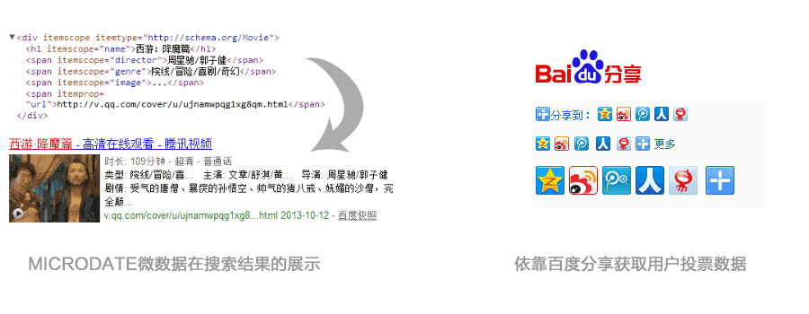

# 百度知心搜索--基于深度数据瓦解和用户行为分析的搜索引擎

看点一、支持 microdate 微数据
1、网页搜索由非结构化搜索向结构化搜索转变，越来越多的结构化信息成为决定排序的因素，同时结构化信息会有更丰富的结果展现形式。
2、microdate 是百度支持的网页规范，通过对网页 html 标签的简单修改，能将普通的网页变成一个格式化的数据接口，让搜索引擎更好的理解网页信息，让网页获得更好的展现、排序。
3、microdate 支持灵活使用，即可以在网页标签中定义，也可以以 xml 文件或者 ping 的形式直接提交。站长平台目前发布并支持 xml 形式提交软件下载、在线文档、通用问答、资料下载等四种格式数据的提交。
　　
看点二、传统超链投票向用户投票转变
1、Web1.0 时代，内容都是网站编辑产生，投票也是在网站间进行，传统搜索引擎均以网站对网站的投票为基础，建立基于超链分析的权值体系。
2、Web2.0 时代，内容创造的主力开始变成用户，投票形式从单一的超链扩展为分享、评价、评分等多种形态，以单个用户为粒度的投票，更能体现网站的价值，这些信息，都会被搜索引擎用来判断网页内容的机制。
　　
看点三、阿拉丁系统
知心的具体表现形式是，将知心搜索结果注入阿拉丁系统，形成标准化页面。用户在通用搜索中发出请求后，搜索结果将引导用户进入这些页面，而这些页面将向用户呈现更为丰富的内容和答案。目前百度知心已有教育、医疗、游戏等多个知识集群，或者说专属页面，其他行业的知识集群也在逐步发展中。
　　
看点四、立体化的搜索结果呈现方式
例如搜索“怀孕”这个关键词，知心的搜索结果中包含的信息量之大，是通用搜索无法做到的。虽然这些搜索结果仍是来自通用搜索，但将其散落在各处的结果关联起来形成答案，发挥出来的作用将会倍增。从这个意义上来说，类似知心这样的产品，可称得上“搜索之搜索”，属于一种更为精细化的搜索产品。

