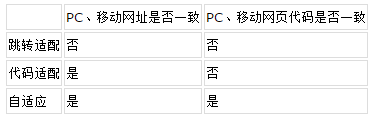
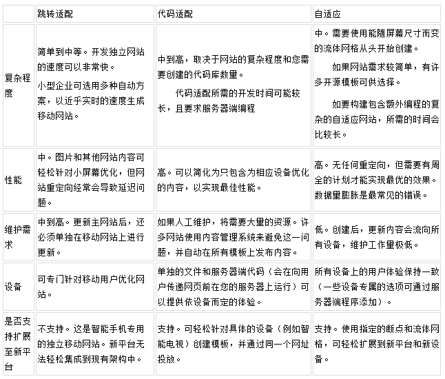
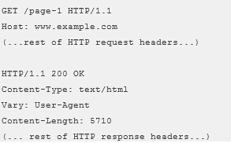
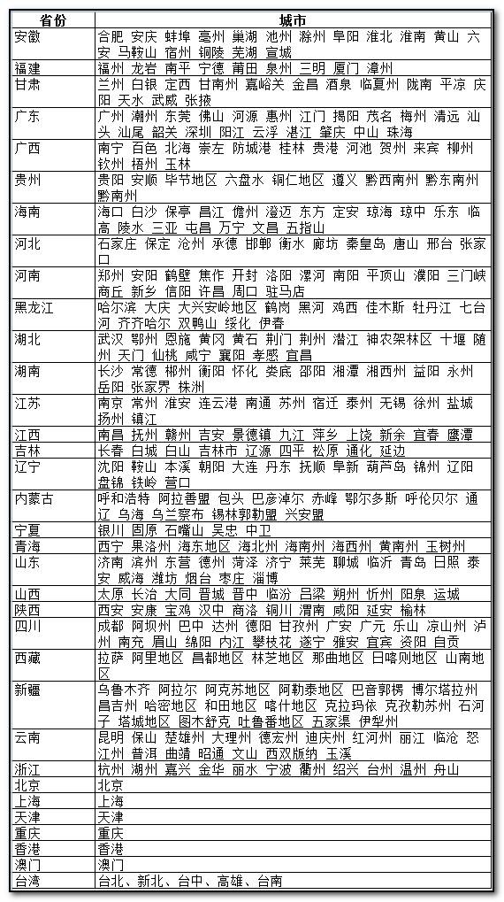

# 移动搜索-为移动站站长提供权威、明确的移动搜索优化标准

百度移动搜索是全球最大的中文移动搜索引擎，每天导向互联网的流量高达十亿级别，网站移动化势在必行。 本篇旨在为移动站站长提供权威、明确的移动搜索优化标准，帮助网站合理、可持续地提升移动流量，获得长久、稳定的发展，从而促进整个移动互联网的良性发展。

> 目前分为五个章节：技术选型、前期准备、良好收录、良好排序、良好展现


## **第一节：技术选型**
如何布局您的 PC 站和移动站，并表达两者之间内容的对应关系

目前较流量的 PC 站与移动站配置方式有三种，百度站在搜索引擎角度将这三种分别称为跳转适配、代码适配和自适应，以下为这三种配置方式的名词解释及异同对比。
**1，跳转适配：**该方法会利用单独的网址向每种设备提供不同的代码。这种配置会尝试检测用户所使用的设备或 ua，然后使用 HTTP 重定向和 Vary HTTP 标头重定向到相应的页面。
**2，代码适配：**该方法使用相同的网址（不考虑用户所使用的设备），但会根据服务器对用户所用浏览器的了解（ua），针对不同设备类型生成不同版本的 HTML。
**3，自适应：**通过同一网址提供相同 HTML 代码的网站设计方法。该方法不考虑用户所使用的设备（pc、平板电脑、移动设备），但可以根据屏幕尺寸以不同方式呈现（即适应）显示屏。



### **三种配置方式的分析**
百度仅站在搜索引擎角度对跳转适配、代码适配、自适应这三种配置方式做了一些对比和分析，希望能够帮助站点选择更适合自己、性价比最优的方式来进行移动化。



### **三种配置方式的优化建议**
1，跳转适配 在此配置中，每个 pc 版网址都具有一个对应的不同网址，用于提供针对移动设备进行优化的内容。为了帮助我们的算法了解单独的移动版网址，我们建议您使用以下注释：
在 pc 版网页上，添加指向对应移动版网址的特殊链接 rel="alternate" 标记。这有助于发现网站的移动版网页所在的位置。

在移动版网页上，添加指向对应 pc 版网址的链接 rel="canonical" 标记。
例如，假设 pc 版网址为 http://example.com/page-1，且对应的移动版网址为 http://m.example.com/page-1，那么此示例中的注释如下所示：

在 pc 版网页(http://www.example.com/page-1) 上，添加：
`<link rel="alternate" media="only screen and(max-width: 640px)" href="http://m.example.com/page-1" >`
而在移动版网页(http://m.example.com/page-1) 上，所需的注释应为:
`<link rel="canonical"href="http://www.example.com/page-1" >`
也可以使用原有的开放适配提交方法。http://zhanzhang.baidu.com/college/courseinfo?id=267&page=15

2，代码适配
为了使百度能够知道当您的页面发生变化时，同时需要用其他的 ua 重新抓取一遍，请您添加 Vary HTTP 标头。Vary HTTP 标头具有以下两个非常重要且实用的作用：

a) 它会向 ISP 和其他位置使用的缓存服务器表明：在决定是否通过缓存来提供网页时它们应考虑用户代理。如果您没有使用 Vary HTTP 标头，缓存可能会错误地向移动设备用户提供 pc 版 HTML 网页的缓存（反之亦然）。

b) 它有助于 百度 spdier 更快速地发现针对移动设备进行优化的内容，这是因为我们在抓取针对移动内容进行过优化的网址时，会将有效的 Vary HTTP 标头作为抓取信号之一，我们会提高用其他 ua 抓取此网页的优先级。

示例：



并且在 pc 的响应的 head 中添加
`<meta name="applicable-device" content="pc">`
在移动的响应的包头中添加
`<meta name="applicable-device" content="mobile">`

3，自适应
自适应设计有其一般原则：在 head 添加以下代码并且使用<picture>元素处理自适应图片:
`<meta name="viewport" content="width=device-width, initial-scale=1.0">`
自适应页面还应该在 head 中标识：
`<metaname="applicable-device"content="pc,mobile">`
表示页面同时适合在移动设备和 PC 上进行浏览。

### **关于移动配置，百度不建议的做法**
1，单一域名下请使用同一种配置方式(跳转适配、代码适配、自适应)，例如，不要把移动站的页面作为 pc 站网址中的一个子目录来配置。

2，如果使用跳转适配的方式，请不要使用 JS 对 ua 进行适配跳转。这种方式存在两个缺点：
a) 对用户：会加大由重定向的客户端造成的延迟；这是因为客户端需要先下载网页，接着解析并执行 JavaScript，然后才能触发重定向。301 或 302 则不会有这个延迟。

b) 对搜索：爬虫也需要使用支持 JS 渲染的爬虫，才能发现此重定向。

## **第二节：前期准备**
### **百度移动搜索优化前期准备工作**
域名：
与 PC 网站一样，域名是用户对一个网站的第一印象。一个好的移动域名，不仅容易记忆、易于输入，还能方便用户向其他人推荐。
域名应尽量简短易懂，越短的域名记忆成本越低，越容易理解的域名能让用户更直观了解网站主旨。移动站域名建议多采用 m.a.com/3g.a.com/wap.a.com 等，避免使用过于复杂或技术性的形式，例如 adcbxxx.a.com/html5.a.com 等。

服务器：
选择正规空间服务商，避免与大量垃圾网站共用 IP，保证网站访问速度和稳定性。其他这里不再赘述，默认有 PC 网站基础。

网站语言：
根据终端以及技术的发展，我们强烈建议使用 html5 作为移动站建站语言，并且根据不同终端机型进行自动适配。

## **第三节：良好收录**
### **获得流量的基础——良好收录**
搜索引擎作为网站的普通访客，对网站的抓取索引、对站点/页面的价值判定以及排序，都是从用户体验出发。因此，原则上网站任何对用户体验的改进，都是对搜索引擎的改进。但是限于当前整体的网络环境以及技术性原因，落实用户体验的具体手段也是需要考虑对搜索引擎友好性的，使之在满足用户体验的前提下也会让搜索引擎更易理解处理。那么，面向移动搜索引擎的网站建设，主要分为三个部分：如何更好的让百度移动搜索收录网站中的内容、如何在移动搜索中获得更好的排名、如何让用户从众多的搜索结果中快速地找到并点击你的网站。简单来说，就是收录、排序、展现。下面我们将从收录开始介绍：

机器可读：
与 PC spider 一样，百度通过一个叫 Baiduspider2.0 的程序抓取移动互联网上的网页，经过处理后建入移动索引中。当前 Baiduspider 只能读懂文本内容，flash、图片等非文本内容暂时不能很好处理，放置在 flash、图片中的文字，百度只能简单识别。建议使用文本而不是 flash、图片、Javascript 等来显示重要的内容或链接，搜索引擎暂时无法识别 Flash、图片、复杂 Javascript 中的内容；同时仅存在于 flash、Javascript 中包含链接指向的网页，百度移动搜索同样可能无法收录。不要在希望搜索引擎可读的地方使用 Ajax 技术，比如标题、导航、内容等等。

结构扁平：
移动站点同样应该有清晰的结构以及更浅的链接深度，这能够使用户快速地获取有用信息，也能使搜索引擎快速理解网站中的每一个页面所处的结构层次。网站结构建议采用树型结构，树型结构通常分为以下三个层级：首页——频道——详情页。

网状链接：
理想的网站结构是树型扁平，从首页到内容页的层级尽量少，这样更有利于搜索引擎进行处理。同时，网站内的链接也应该采用网状结构，网站上每个网页都要有指向上、下级网页以及相关内容的链接，避免出现链接孤岛：首页有到频道页的链接，频道页有到首页和普通内容页的链接、普通内容页有到上级频道以及首页的链接、内容相关的网页间互相有链接。网站中每一个网页，都应该是网站结构的一部分，都应该能通过其他网页链接到，这样才能使 baiduspider 尽可能全地遍历网站内容。同时，重要内容应该距离首页更近，有利于价值传递。

简单易懂的 URL：
具有良好描述性、规范、简单的 URL，有利于用户更方便地记忆和直观判断网页内容，也有利于搜索引擎更有效地抓取和理解网页。网站设计之初，就应该有合理的 URL 规划。我们认为：
1、对于移动站首页一般采用 m.a.com/3g.a.com/wap.a.com；
2、频道页采用 m.a.com/n1/、m.a.com/n2/（其对应于 PC 站点的频道 n2.a.com），当然，n1、n2 直接可读更佳；
3、详情页的 URL 尽量短，减少无效参数，例如统计参数等，保证同一页面只有一套 URL 地址，不同形式的 URL301 跳转到正常 URL 上；
4、Robots 封禁 baiduspider 抓取您不想展示给用户的 URL 形式以及不愿被百度抓取的私密数据。

涵盖主旨的 anchor：
anchor 即锚文本，对一个链接的描述性文字，锚文本写得越简洁明确，用户越易明白该指向网页的主旨内容。用户发现你的网页是从其他网页上的链接，锚文本是该网页的唯一介绍。跟普通用户相同，搜索引擎 spider 在刚发现一个网页时，锚文本也是对该页面理解的唯一因素，同时对于最终的排序起到具有一定的作用。

工具“移动 sitemap”：
百度站长平台提供了移动 sitemap 提交工具，通过提交 sitemap，可以使百度更快更全地抓取收录网站内容。

工具“移动索引量”：
百度站长平台同时提供了移动索引量工具，可以使站长及时了解到自己网站在移动端的收录情况。

工具“移动死链提交”：
百度站长平台还提供了移动死链提交工具，通过提交死链 sitemap，可以使百度更快地发现网站死链进行更新删除。

合理的返回码：
百度 spider 在进行抓取和处理时，是根据 http 协议规范来设置相应逻辑的，常用的几个返回码如下：
404，百度会认为网页已失效已删除，通常在索引中删除，短期内 spider 再次遇到也不会抓取。建议内容删除、网页失效等的情况下使用 404 返回码，告知百度 spider 该页面已失效。同时网站中尽量减少死链的累计。如果网站临时关闭或抓取压力过大，不要直接返回 404，使用 503。

301，永久性重定向，百度会认为当前 URL 永久跳转至新 URL。当网站改版、更换域名等情况下，建议使用 301，同时配合使用站长平台的网站改版工具。

503，百度会认为临时不可访问，不会直接删除，短期内再来检查几次。如果网站临时性关闭建议使用 503。

### **移动网站建设常见问题**
移动网站兴起时间不长，站长有很多相似的问题。在 2014 年 11 月份的百度移动搜索沙龙上，移动专家针对站长提问较多的问题进行了统一回答，与往期沙龙的零星回答合并整理如下：

问：我的移动站内容和 PC 站是一样的，这样需不需要屏蔽百度的 PC 搜索蜘蛛？
答：由于百度的 PC 搜索和移动搜索共用同一个 spider，都带有 baidu 标示，不要进行屏蔽。Spider 在抓取时会对页面进行识别，自动判断是 PC 页还是 mobile 页，因此建议站长使用规范的 html5/xhtml 协议语言来建设移动站。

问：手机站使用 xhtml 与 html5 开发，对搜索引擎是否有区别？
答：大家使用手机搜索时会发现用 2G 的情况下移动搜索会给你到极速版，就是保证你得到结果的速度足够快，但是结果样式比较简单。一般情况下极速版我们会优先给 Xhtml 的结果，触屏版优先给 html5,效果更加炫酷。

问：如果是 URL、PC 访问和移动访问分别识别不同的模版，例如我们有一个 URL，PC 访问是是这个模版，手机访问是那个模版。那么我们是使用相同的 URL 好，还是单独的做一个 M 站好？
答：理想状态下同一套 url 是最优的。目前受限于机制问题，还有待进一步解决，预期 14 年底能够完成。目前仍然建议大家移动站使用单独的 m 链接。同时，暂时不要使用类似这样的 url： http://m.site.com?src=http://www.site.com 。

问：感谢，我们是这样理解吧，未来的话如果以用户习惯来说，是同一个 URL 好？
答：理想的技术角度看，是同一个 url 更好，但是目前尽量仍然使用单独的 m 链接。

问：一个站点有 M 站和 PC 站，采用完全相同的 TDK，是否有问题，手机站的 SEO 规则是否跟 PC 站相同？
答：TDK 代表标题、摘要、关键词是吧？先理解一下。是这样的，PC 端和移动端搜索结果展现标题和摘要的字数限制等都是不同的，PC 端 30 多个中文汉字才截断，移动端不到 20 个就折行了，20 多个就省略看不到了。所以，建议移动站使用单独的 TDK。

问：如果两个站点它的 TDK 都是完全相同的，每一个页面，会不会导致站点被惩罚？
答：这里说的两个站如果指同一个站点的 PC 和移动，肯定是不会导致被惩罚的。

问：外链对手机站是否有效果？
答：外链还是有效果的，但不要做那些垃圾外链，比如说论坛的标签里面或者说买卖链接或者是说批量的发链接有可能被惩罚。正常交换一下链接是有帮助的。0 和 1 是明显不同的。

问：百度移动搜索对我的移动站收录较少，该如何做？
答：1. 如果您同时具有 PC 站，且 PC 与移动站是一一对应的关系，请利用开放适配工具进行提交，既可以帮助移动站的收录又可以帮助您将 PC 站的排名转移至移动搜索； 2. 如果您只有移动站，也可以通过我们的移动 sitemap 工具向百度进行提交。
　
## **第四节：良好排序**
### **如何在百度移动搜索获得良好的排序**
同 PC 端的需求一样，收录问题解决后面临的就是排序问题了。在介绍排序原则之前先简休介绍一下移动搜索结果的构成，移动搜索主要有如下几类结果构成：移动页面、转码页面、PC 页面。

整体上，移动搜索的结果是由 PC 搜索结果加入更多的移动端特征后进一步调整而来，优先对移动页面进行排序。其中，移动页面结果包括开放适配提交的与 PC 一一对应的移动页以及单独的移动页面。百度移动搜索引擎中为更好满足用户信息需求，会同时为用户提供 PC 网页和 mobile 网页，但目前大多数 PC 页在移动终端中直接浏览的体验较差（交互、兼容和流量等）。因此，我们会对百度搜索结果中缺乏可替代 mobile 资源的 PC 页进行格式转换，变为适合手机浏览的 mobile 网页，使其能在移动终端浏览器有较好的浏览体验，这便是转码页面。其他 PC 页面，是百度经过各种策略识别发现其没有对应的移动页面资源、且转码后体验不佳的情况下保留的一种结果类型。对于后两者我们强烈建议站长进行移动化。

下面我们主要来说说如何才能在百度移动搜索获得良好的排序：
1， 需要主旨明确的标题：
网页的 title 用于告诉用户和搜索引擎这个网页的主题是什么，搜索引擎判断一个页面内容权重时，title 是主要因素之一。每个页面的内容都是不同的，都应该有独一无二的 title。移动站的标题应该注意如下：

1）主题明确，涵盖页面主旨内容；
2）不罗列关键词，使用户能够快速分辨出主题，最好不超过 17 个中文汉字，否则在搜索结果中会被折行，超过 24 个会被截断；
3）重要内容往左放，保持语义通顺；
4）使用用户熟知或习惯用语
百度建议不同层级页面的标题按照如下的形式来命名：

- 首页标题：网站名称_核心服务 or 核心产品
- 频道页标题：（频道核心服务_）频道名称_网站名称
- 详情页标题：文章标题_频道名称_网站名称

2，优质的原创内容建设、整合系列服务：
网站的服务对象是用户，搜索引擎只是网站普通用户中的一员，因此，一切从用户角度出发提供用户需要的原创内容、整合系列服务非常重要，每天保持一定数量的原创内容更新，同时可以对优质内容、系列服务进行整合形成专题。但是，鉴于技术的现状，仍然要注意如下几点：
1）不要使用 ajax 技术在希望搜索引擎可读的地方；
2）不将主要内容创建在 iframe 框架中；
3）移动端很多内容使用图片，搜索引擎目前无法理解复杂图片，请使用 alt 标签进行标记；

3，做好终端适配：
随着移动互联网的发展，越来越多的用户使用移动设备访问网站，百度移动搜索会对移动站给予优先排序的机会，对于有 PC 网站的站长，我们强烈建议您做以下工作：
1、做好自适配，将移动终端的访问自主适配跳转至移动版站点；

2、为了更快地告知百度移动搜索您 PC 网站与移动站内容的一一对应关系，建议使用站长平台开放适配工具进行适配关系提交。
关于开放适配帮助可以参考：http://zhanzhang.baidu.com/wiki/39

3、同时还可以使用如下 Meta 标签协议规范：
- 如果该网页只适合在电脑上进行浏览，例如（http://www.sina.com.cn/ ），在 html 中加入如下 meta：
<meta name="applicable-device" content="pc">
- 如果该网页只适合在移动设备上进行浏览，例如（http://3g.sina.com.cn/ ），在 html 中加入如下 meta：
`<meta name="applicable-device"content="mobile">`
- 如果网页采用了响应式网页设计，例如（http://cdc.tencent.com/） 不需要经过 url 自适配跳转就可以根据浏览器的屏幕大小自适应的展现合适的效果，同时适合在移动设备和电脑上进行浏览，在 html 中加入如下 meta：
`<meta name="applicable-device"content="pc,mobile">`

4，地理信息标注有助于获得更精准的流量：
为了方便用户根据自身位置查找或使用本地信息与服务，百度移动搜索将根据用户地理位置信息优先将具有地域属性的内容展现给用户，如果是提供地域性信息服务的站点，可以通过为自己网页添加地理位置信息 Meta 标注，让目标用户在百度移动搜索中更快的找到您网站的内容。具体用法可见下一小节《如何为移动站点添加地理位置信息》

5，尽量快的加载速度：
移动互联网上，网站的打开速度对用户体验的影响更加凸显。实验表明一个页面的打开时间超过 4~5s，绝大部分用户选择关闭。因此，加载速度也是百度移动搜索中一个重要的排序因素，站长需要在这方面进行专项优化。

6，搜索结果转码：
在移动终端中直接浏览 PC 页面体验较差（交互、兼容和流量等）。为改善搜索用户的浏览体验，我们会对搜索结果中缺乏可替代移动资源的 PC 页（无移动站）进行格式转换，变为适合手机浏览的移动网页。如想了解更多可参考：转码声明。我们强烈建议没有移动化的站长进行网站移动化，提交开放适配，将转码流量领回家。

### **如何为移动站点添加地理位置信息**
上面我们说到站点添加准确的地理信息将有助于获得更精准的流量，接下来我们针对这个话题进行详细解释：为方便用户根据自身位置查找和使用本地信息与服务，帮助移动站点健康、稳定地提升流量，百度移动搜索现提供地域优化服务。如果您是提供线下信息服务的站点，可以通过为自己的网页添加地理位置信息的方式，让您的站点所在地的用户更快在找到您。
具体方法很简单，您只需在具有地域性的页面上进行如下标识即可：

【Meta 声明格式】
`<meta name="location" content="province=北京;city=北京;coord=116.306522891,40.0555055968">`
Name 属性的值是 location。Content 的值为 province=北京;city=北京;coord=116.306522891,40.0555055968。
province 为省份简称，city 为城市简称。具体参见下面省份和城市列表。
注：province 及 city 不可为空。
coord 是页面信息的经纬度坐标，采用的是 bd09ll 坐标。若页面信息为城市级别，填写城市中心点即可。若页面信息有具体的地址，经纬度坐标填写该具体地址的坐标（可以通过百度地图的地址解析 API 获取）。

【Meta 位置】
站长需要将 Meta 声明放在网页源代码<head>标签内部，如下：
```
<head>
<meta name="location" content="province=北京;city=北京;coord=116.306522891,40.0555055968">
……
</head>
```

## 【**常见问题**】
问：是不是 PC 站和移动站都要标？
答：首先，地域标签主要应用于移动搜索。而移动搜索检索机制支持用户搜索到 PC 站或移动站，所以 PC 站和移动站都需要标记。

问：标了这个有什么好处？
答：从百度用户的搜索行为可以看到，大量的用户对于本地或者附近的结果更有倾向性。站长配合进行地域信息标注后，我们将根据页面的地域信息和用户所在位置进行匹配，优先展示距离近的结果。也就是说，您的站点将更有机会被当地用户看到。

问：经纬度可以为空吗？
答：A：可以为空。如果没有经纬度，可以是<meta name="location" content="province=北京;city=北京">

问：我们的站点更多是外地用户在搜索，打了标签后会不会有问题？
答：不会出现问题。百度移动搜索会通过精准的需求识别，对“外地搜索”行为做特殊策略，不会影响到搜索异地结果。同时，站长还是需要注意只对页面内容或服务本身具有较强地域属性的页面进行地域信息标注。

问：这个移动搜索的地域优化标签做好后，是否需要单独提交？
答：没有标记经纬度的话不需要单独提交。如果页面更新了，可以到站长平台提交 sitemap，加速百度收录的速度。

【省份与城市列表】



## **百度移动搜索开放适配服务**
为了提升用户的移动搜索结果浏览体验，百度移动搜索对具有对应手机站的 PC 站提供“开放适配”服务。如果您同时拥有 PC 站和手机站，且二者能够在内容上对应，您可向百度“提交”PC 页—手机页的对应关系，若对应关系准确，将有助于百度在移动搜索中将原 PC 页结果替换为对应的手机页结果。积极的参与“开放适配”，将有助于您的手机站在百度移动搜索获得更好的展现，同时以更佳的浏览效果赢取用户口碑。

百度开放适配服务共提供三种方案——自主适配、标注 Meta 声明、提交对应关系 Sitemap，同时向站点提供开放适配进度查询。

### 一、自主适配
站点自己做好 PC 与手机之间的适配，以及手机站各个版式之间的适配。当手机用户通过百度移动搜索或者其他方式访问站点的 PC 页时，站点将其自动适配到该 PC 页面对应的手机页，并为之选择合适的页面版本。

站点若暂不具备自主适配的能力，可以使用百度提供的终端适配服务，简单快捷地实现自主适配。即：站点调用百度终端适配服务 API 进行简单的开发，就可以获取到访客的终端信息（包含操作系统、浏览器、机型信息）及适配版式建议，根据这些信息在站点服务器上实施跳转进而完成自主适配。详情可点击查看终端适配服务介绍

举例：
1）频道页：当用户使用手机访问 http://sports.sina.com.cn/nba 时，站点自行适配到 http://nba.sina.cn
2）内容页：当用户使用手机访问 http://bbs.gfan.com/android-4038549-1-1.html 时，站点自行适配到 http://bbs.gfan.com/mobile/android-4038549-1-1.html

生效情况：不仅限于百度移动搜索，当用户通过手动输入网址，或者通过其他移动搜索引擎、导航站等渠道访问站点时，适配同样有效。

### 二、标注 Meta 声明
站点如果自行适配有困难，可以在 PC 页面中做简单改造，百度协助实现适配效果。即：站长在站点 PC 页的源代码头部嵌入一行或多行 Meta 信息，由 Meta 信息来指明该 PC 页对应的手机页的 URL，以及该 URL 对应页面的格式，百度将根据用户终端类型选择最适合展示的页面。（无对应关系的 PC 页面无需添加 Meta ）

1.Meta 声明格式：`<meta name="mobile-agent"content="format=[wml|xhtml|html5]; url=url">`
注：A.加粗字体部分是需要站点自定义的内容。
[wml|xhtml|html5]——根据手机页的协议语言，选择其中的一种。
url=url——后者代表当前 PC 页所对应的手机页 url，两者必须是一一对应关系
Meta 声明示例：
`<meta name="mobile-agent" content="format=html5;url=http://3g.sina.com.cn/">`
`<meta name="mobile-agent" content="format=xhtml;url=http://sina.cn/">`

2.站长需要将 Meta 声明放在 PC 页源代码内部，如下：

```
<head>
<meta name="mobile-agent" content="format=html5;url=http://3g.sina.com.cn/">
……
</head>
```

生效情况：标注 Meta 声明这一适配方案仅在百度移动搜索中生效，即只有当用户通过百度移动搜索访问站点时，适配才会生效；通过其他渠道则不生效。在标注准确对应关系无误的情况下，大约需要七天左右的时间生效，老旧页面会有延迟。但百度不保证一定能在移动搜索结果中按照您标注的对应关系进行替换。

### 三、提交对应关系 Sitemap
当站点推动 PC 页标注有困难时，可以选择提交 PC 页-手机页对应关系 Sitemap，帮助百度在移动搜索结果进行替换。页面对应关系可以是 url 级别或者 pattern 级别的；站点也可以根据自身情况，将具备一定规律的 url 聚合成 pattern，无法聚合的则仍以 url 对应形式存在，在站长平台分开提交。

url 级别 sitemap：通过 XML 文件描述 url 级别的 PC 页与手机页的对应关系。（制作方式请点击查看）

pattern 级别 sitemap：一个 pattern 级别的对应关系，往往可以表示成千上万的 url 对应关系。通过 pattern 的形式批量的提交对应关系，能够大大减少站长提交的数据量。（制作方式请点击查看）

提交方式：使用站长平台-对应关系提交工具进行提交（工具使用方法请点击查看）

生效情况：与 meta 方案相同，仅限于百度移动搜索中生效。在提交的对应关系无误的情况下，大约需要七天左右的时间生效，老旧页面会有延迟。百度不保证一定能在移动搜索结果中按照您提交的对应关系进行替换。

### 四、开放适配进度查询
提供包括手机站点击量、适配点击量在内的开放适配进度数据，便于站点及时了解开放适配的进度情况，把控自身流量数据。同时提供站点尚未进行适配的页面/频道排行榜，建议站点优先进行适配，并持续不断建设更多新的对应关系。

查询方式：
1.注册并登录百度站长平台
2.提交 PC 网站并验证归属，具体验证网站归属方法可见帮助文档
3.点击网站名称下具体需要进行适配的 PC 站，进入“站点工具”——“开放适配工具”——“开放适配进度查询”

### 五、开放适配常见问题
**百度移动搜索排序常见问答**
首先必须承认百度站长平台关于移动搜索的内容还不够多，现有问答量也非常少，大家不要着急，我们会尽快补充，希望大家持续关注我们官方课程内容。

问：如果发现移动站流量波动，该怎么办？
答：网站流量短时间内的少量波动一般来说是正常现象。当流量波动持续时间较长且幅度较大时，则需要排查原因，建议站长：
1. 自查移动站点运营是否正常，流量统计渠道是否准确
2. 如果参与了开放适配，可以通过进度查询工具了解开放适配带来的流量情况；
3. 同时确认 PC 站流量在百度网页搜索中的流量变化。（移动站的流量波动可能与 PC 站流量波动相关联）
4. 最后请确认是否自身做了过度优化，如果是，移动搜索的反作弊系统会自动对您的网站进行一定的处理。

问：百度移动端对做了移动样式的站点的排名是否有照顾？移动端适配成功后是否可以把很多没做适配的站点挤下去?
答：做了移动适配的站点比 PC 的网站，其他都相同的情况下，我们会优先展示适配移动的站点。系统中是更倾向于将移动站优先展现的。

问：用户使用 m.baidu.com 搜索时不同的终端排名不一致，比如说 iphone 搜索与安卓手机搜索结果不一致，部分排名也跟 PC 端访问的百度差很远.
答： ios 和安卓不同的系统下我们会有微调，但理论上的差别不会特别大。例如搜索同一款 app，安卓和 ios 系统下是需要给出对应该系统的结果的。第二个问题，从人、设备、使用场景及移动站特征看，PC 和移动都是存在明显差异的，因此，未来移动端的排序与 PC 端的差异会更加明显。

**百度移动搜索适配常见问答**
问：百度移动搜索上我的移动站点与 PC 站夹杂，怎么告诉搜索引擎优先展示移动站点？
答：首先，您最好在自己网站上做好自适配，使得不同端的用户访问可以获取到体验最好的页面；其次，如果移动站的内容对 PC 站能够完全对应，建议通过开放适配进行替换。百度鼓励 mobile 资源，对 PC 资源在移动端是持排斥态度的，不优先展现。

问：提交开放适配以后，搜索结果中的 PC 页面为什么没有跳转到 mobile 页面？ 甚至会被转码。
答：开放适配未生效时，百度仍然会认为该结果为 PC 页，则有可能对其进行转码。而开放适配未生效有以下几个原因：

1、数据提交过程有误。包括数据的提交格式、提交入口、正则规则等；对应关系有误。包括 PC 页与 mobile 页未一一对应、mobile 页死链或发生跳转、mobile 页与 PC 页内容不一致等；
2、mobile 页面协议编写不规范，百度无法正常识别；
3、自主适配时，使用 javascript 跳转不利于百度爬虫抓取。建议 301 跳转。
4、其他更多适配问题参考：http://zhanzhang.baidu.com/wiki/39

问：百度移动端对做了移动样式的站点的排名是否有照顾？移动端适配成功后是否可以把很多没做适配的站点挤下去？
答：做了移动适配的站点比 PC 的网站，其他都相同的情况下，我们会优先展示适配移动的站点。系统中是更倾向于将移动站优先展现的。

问：手机站有 html5 和 xhtml 两个版式，但访问的域名均为 m.a.com，应该如何进行 PC 页的 meta 标注呢?
答：可对同一条 url 进行多个版式的标注。例如：`meta name="mobile-agent"content="format=xhtml; url=http://m.a.com/" meta name="mobile-agent"content="format=html5; url=http://m.a.com/"`
问：PC 页还标了除百度要求以外的有其它作用的 meta 信息，会影响百度移动搜索优化的效果吗?
答：在对应关系上百度只提取符合百度制定标准的 meta 信息 `meta name="mobile-agent" content="format=[wml|xhtml|html5];url=url"` ，其他信息只要不与标准冲突就不会影响。

问：请问 Meta 标注中 url 字段可否使用相对路径？比如 url=/3g/ 这样的格式？
答：不可以，目前 meta 标注中的 url 字段不支持相对路径，只支持绝对路径

问：为什么我做了 Meta 标注，却在百度移动搜索中没有生效？
答：做了标注却没有在移动搜索中生效，可能由以下原因导致:仍在 meta 信息处理期内。在标注准确对应关系无误的情况下，meta 信息的处理时间约为 7 日左右，老旧页面会有延迟。或者 Meta 标注的格式错误，如标注的位置错误、url 拼写错误。还有可能是 PC 页-手机页对应关系本身错误。如手机页不可用（无内容/报错）、PC 页与手机页主体内容不一致等。

问：使用开放适配服务，还有其他需要注意的事项吗？
答：放开对百度 spider 的 robots 封禁和屏蔽，方便 spider 获取您 PC 站与手机站之间的对应关系。同时做好手机站流量预留工作，提前确认服务器的承载能力。（可至百度统计了解目前您的 PC 站在百度移动搜索中的流量，预估适配后您的手机站可能达到的流量峰值）

问：如何提升开放适配效果
答：首先，对已有的对应关系持续进行适配，同时不断建设新的对应关系，增加适配覆盖的范围。其次，要确保已经标注/提交的对应关系对应准确。以下是常见的对应不准确错误，请网站进行自查，并及时修改。

1，手机页不可用，比如死链。
2，robots 封禁。放开对百度 spider 的 robots 封禁和屏蔽，以便 spider 获取您 PC 站与手机站之间的对应关系。
3，手机页使用了 ajax 等异步加载的方法加载内容主体。
4，格式错误。包括 meta 标注的位置、格式错误，对应关系 sitemap 格式错误等。
5，对应关系错误

1）当 PC 页为内容页时，应该适配到对应的手机页内容页，而实际却适配到手机页的首页/列表页。
例如 PC 页为 http://www.qidian.com/Book/2083259.aspx，适配后的手机页为 http://qidian.cn/?from=web
2）手机页本身无主体内容/主体内容过少。
3）手机页需登录才能浏览主体内容。
4）PC 页内容与手机页内容不存在一一对应关系。

正确的对应关系示例：
PC 页 http://sports.sina.com.cn/j/2012-08-13/23516189909.shtml
手机页 http://sports.sina.cn/?sa=d4634022t24v4&cid=797&pos=10&vt=4

**百度移动搜索转码常见问答**
问：能否分享下百度转码的场景——对哪类页面会转码？现在我们发现我们触屏版的 mobile 页也会被转码
答：由于 PC 页在移动端的用户体验较差，因此百度对所有的 PC 页面类型都可能进行转码，但是会根据转码后的页面质量及服务是否正常来决定最终是否转码。如果站长已经做好了自适配但发现仍然被转码，其原因是网站的自主适配暂时未被百度识别。

问：不希望百度转码该怎么办？
答：百度的转码服务实际上有一段代码可以强制要求百度不转码，可以把这个写在 html 中。

**禁止百度移动搜索对网页进行转码的方法**
在百度移动搜索引擎中，为了更好地满足用户需求，会同时为用户提供 PC 网页和 mobile 网页，但目前受交互、兼容和流量等因素影响，PC 页在移动终端中的直接浏览体验较差。因此，百度移动搜索对缺乏可替代 mobile 资源的 PC 页进行格式转码，将其转换为适合手机浏览的 mobile 页，使其能够在移动终端浏览器有较好的浏览体验。为了最大程度改状况 PC 页在手机上的浏览体验，转码时会去除 PC 页中不能在手机浏览器上浏览的内容，并改状况不适用 mobile 的交互功能。目前不仅百度移动搜索提供转码技术，各大搜索引擎均有并提供类似的技术。

那么，如果站长不希望自己的站点被转码、依然希望手机端用户浏览 PC 页该如何操作呢？可以使用 no-transform 协议，no-transform 协议为如下两种形式：

第一种，HTTP Response 中显式声明 Cache-control 为 no-transform。

第二种，meta 标签中显式声明 Cache-control 为 no-tranform，格式为：

```
<head>
<meta http-equiv="Cache-Control" "no-transform " />
</head>
```

如果站点不希望页面被转码，可添加此协议，当用户通过百度移动搜索进入该网站时会进入原网页浏览。

还有一种情况，即站点本身有对应的 mobile 页面所以不希望被转码时，建立站长使用百度移动搜索的开放适配服务，百度会帮助用户直接进入对应的 mobile 页面。

## **第五节：良好展现**
### **在移动搜索展现端获得良好表现的注意事项**
移动网站优化和 PC 网站的很多方面都是相似甚至相同的，但由于移动搜索界面大小受限，移动网站在标题和摘要的撰写上有很多有别有 PC 端的情况。

1，有吸引力的 title
用户在百度移动搜索中输入 query 搜索到你的页面时，title 作为最重要的内容展现在搜索结果中，主题明确、吸引眼球的 title 能够使用户第一时间理解你页面的主题是否符合他的需求，进而更快捷地从众多搜索结果中选择你点击你。所以，移动网页的 TITLE 应该是：

- 主题明确；
- 简洁扼要，不罗列，尽量不超过 17 个中文汉字，否则会折行；
- 如果你的品牌知名度高，品牌词最好能够展现出来；
- 在与内容相符的前提下，吸引眼球

2，不唯一的 description,
作为搜索结果摘要的重要选择目标之一，一定不要采用默认形式，用适当的语言对页面进行进一步描述，对 title 的进一步补充，能够使用户更进一步理解你页面的内容与其需求是否匹配，让你的目标用户更快找到你点击你。

- 对 title 的进一步补充，准确描述页面内容，但不堆砌关键词，否则可能被认为有作弊嫌疑；
- 每个页面要有不同的 description，尽量不适用默认一样的；
- 适当的长度，超出会被截断.