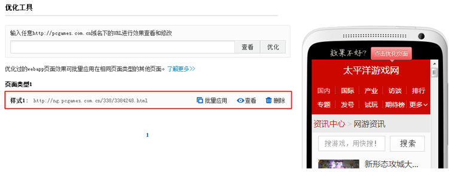

# 百度 Site App 操作指南_流程指南

## 概述

### **平台支持的站点类型**

理论上，只要不是全 flash 网页或者大量 frame 框架结构的站点，百度 Site App 都可以支持。但是由于目前 Site App 平台对一些复杂脚本的处理方式有待改善，且对于注重交互功能的页面转化效果欠佳，因此建议以阅读和浏览类为主的站点，优先选择使用百度 Site App；其他类型的站点，可以实际测试效果，根据效果的改善情况适时参考是否选用。

### **对开发者的要求**

- 具有对网站主域或子域验证权限
- 具有网站域名 DNS 解析权限
- webapp 域名配置权限

### **流程指南**
如何使用 Site App，尽快让用户使用，标准流程如下图所示：

### **账户申请**
如何申请

马上申请，已有百度帐号，点击这里登录。

## 添加站点
输入需要生成 WebApp 的网站地址，如下图所示：

### **建议：**
1. 建议您提交顶级域名，这样其下子域名将自动生成 WebApp,无须多次操作。（什么是顶级域名？）
2. 若您有特殊需求，只需要某个子域打造成 WebApp，则您直接提交子域地址即可
3. 百度 Site App 是将 pc 网站转换成 WebApp，所以为了保证最佳效果，请勿使用手机站点地址。

## 定制效果
### **Step1:样式**

您需要给 WebApp 起个响亮的名字。同时提供上传网站 logo 功能，使 WebApp 更加多彩。

目前平台提供 5 套模板：通用模板 A、B、C 提供电话、在线沟通、短信等转化组件；列表风格简单明快，列表可以连续加载；网页风格提供多种导航，可自由布局。以上 5 套模板都提供多种配色方案。您可以根据网站的特点及喜好进行相应的选择。

### **Step2:导航**
定制导航 WebApp，搭建 WebApp 框架。
系统会自动从原 PC 站提取一级导航，您可对导航进行编辑、调序、删除、添加二级导航等。

新增导航有两种方法：手动添加导航或去原网页提取导航

当没有一个一级导航处于选中状态时，点击添加和提取的是一级导航。
当某一个一级导航处于选中状态时，点击添加和提取的是该选中一级导航的二级导航。
1.手动添加导航
点击添加导航出现如下图输入框，输入导航名称、PC 页面的链接地址点击确定即可添加。

2.去原网页提取导航
点击提取导航，弹出原 PC 界面如下图。点击想要添加成导航的内容，蓝色浮层表示选中；通过放大和缩小键控制框选的范围，确定后点击定义为导航即可。

### **Step3:全局**
主要是对网站基本信息的设置，让您的 WebAPP 更突出个性化。同时此处可以设置转化组件，如 webapp 电话、短信、在线咨询、地图等。

右侧手机可预览系统自动生成的页面效果。 如想优化页面效果，可在完成建站流程后 到“管理我的 webapp => 优化工具”中进行页面效果的优化定制。

## 验证站点
如下图所示，您可以选择任意一种方式验证站点

### **温馨提示：**

1. 验证站点的目的只是确保您拥有该网站的操作权限，不会对您的网站带来任何的风险。
2. 在下载验证文件或嵌入 html 标签时，请不要关闭该页面，同时请在下载代码或获取文件之后，不要尝试刷新页面或从新请求，那样会造成动态文件变化，导致验证失败。
3. 下载验证文件或复制 html 标签，需要当即验证，否则下载文件及复制代码将失效，导致验证失败。

## 完成界面
完成以上所有步骤后，恭喜您 WebApp 创建完毕！等待审核，审核时长约 1 个工作日。

在提交审核的同时系统自动分配了 WebApp 的访问地址，在通过审核后该域名即可访问。

仍建议您为手机站配置专属移动域名，配置成功即可进行移动变现管理；也会更好的进行网站个性化推广，以及网站品牌形象的维护。

手动配置的域名会优先生效，而自动分配的访问地址将带给您多一层保障，再无须担心域名过期导致的站点无法访问等问题。

## 域名部署
1.绑定一个专属 webapp 域名。
2.请将您已提交的 WebApp 域名的 CNAME 解析到 siteapp.baidu.com
*需在 6 小时内完成此操作，否则域名配置失效。

### **CNAME 配置指南什么是 CNAME？**
指别名记录也被称为规范名字。这种记录允许您将多个名字映射到同一台计算机。

### **为什么要配置 CNAME？**
在 WebApp 制作中，配置 CNAME 是为了自定义您的 WebApp 域名，例如 m.a.com 或 wap.a.com。

### **如何配置 CNAME？**
以 DNSPod 为例

- A.主机记录处填你希望的 WebApp 域名（比如希望新建的 WebApp 域名为 m.a.com，只需要在主机记录处填写 m 即可）
- B.记录类型为 CNAME
- C.线路类型（默认为必填项，否则会导致部分用户无法解析；在上图中，默认的作用为：除了联通用户之外的所有用户，都会指向 1.com）
- D.记录值为 CNAME 指向的域名，填写 siteapp.baidu.com，记录生成后会自动在域名后面补一个“.”，这是正常现象
- E.MX 优先级不需要填写
- F.TTL 不需要填写，添加时系统会自动生成，默认为 600 秒。（TTL 为缓存时间，数值越小，修改记录生效时间越快）
- 不同的域名提供商提供的 CNAME 配置界面、选项会有细微差异，您只需重点把握 A、B、D 三个选项即可。

更多域名提供商 CNAME 配置教程请见：
公司品牌    cname 官方配置教程
万网        http://www.net.cn/service/faq/jzwt/scyy/201111/5125.html
DNSPOD     https://www.dnspod.cn/support/index/fid/105
35 互联    http://www.dns-diy.com/help.htm
商讯国际    http://www.bizxun.com/help/domain2.asp
新网互联    http://www.dns.com.cn/main/public_doc.php?doc=DomainReg/mydns
易名中国    http://help.ename.cn/faq/faqinfo/84
西部数码    http://www.west263.com/faq/list.asp?unid=423
中资源      http://help.zzy.cn/info.asp?id=328
商务中国    http://www.bizcn.com/news?module=newsdetail&newsid=3283
美橙互联    http://www.cndns.com/help/index.asp?classid=3&id=224

## 扩展服务
成功建站的 WebApp 还可获取真机测试、变现管理、质量报告、生成应用、统计等服务。

## 优化工具
Webapp 的页面效果可在这里进行定制优化。

左侧可输入原 PC url 查看页面效果；下方是系统推荐定制的 url 和您已经完成定制的 url。

右侧手机界面展示自动生成的页面效果，可随意点击手机界面进入相应页面，点击上方的“立即优化”即可对页面效果进行定制，如下图。

点击优化进入到定制界面，在左侧 PC 页面点击您希望添加到 WebApp 的内容，输入内容名称及地址链接后，选择希望转化的组件，最后点击添加即可，见下图

完成页面效果定制的 url 会保存到下图左侧，每定制一个保存一个。

系统会对网站的页面类型进行分析。完成分析后，对于属于同一个页面类型的页面会聚合到一起，形成“页面类型 1”、“页面类型 2.3.4.5...” 此时可使用批量应用功能。

### **批量应用功能是指：**
以下图为例，在“页面类型 1”中，曾对三个页面定制了三种页面效果（样式 1、样式 2、样式 3）。以其中一个 “样式 2”的页面效果为标准，对于同属于“页面类型 1”下的其他页面批量应用“样式 2”的效果（不包括样式 1、样式 3 的页面）。

注：同一个页面类型中，只能选一个“样式”的效果作为标准。

## 数据统计
平台支持添加百度统计代码，添加后到百度统计查看更专业的数据及相关分析。添加方法如下：
登陆百度统计，进入主界面后点击“网站中心”

在网站列表处点击“新增网站”

输入手机站点域名点击确定

即可获取该手机站的统计代码

复制代码添加至平台百度统计代码的输入框内即可。 添加代码后，可到百度统计查看相关数据统计。

## **合作案例**
请见案例展示专区：http://siteapp.baidu.com/example_show