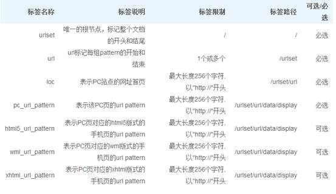
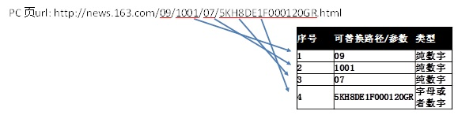
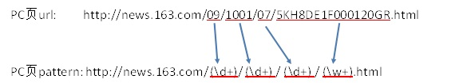
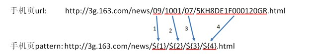

# 开放适配工具帮助

## 什么是开放适配？
为了提升用户的移动搜索结果浏览体验，百度移动搜索对具有对应手机站的 PC 站提供“开放适配”服务。如果您同时拥有 PC 站和手机站，且二者能够在内容上对应，您可向百度“提交”PC 页—手机页的对应关系，若对应关系准确，将有助于百度在移动搜索中将原 PC 页结果替换为对应的手机页结果。积极的参与“开放适配”，将有助于您的手机站在百度移动搜索获得更好的展现，同时以更佳的浏览效果赢取用户口碑。了解更多，请点击 http://www.seozixuewang.com/post/1536.html

## 为什么要使用对应关系提交工具？
对应关系提交工具可以实现 url 级别或 pattern 级别的 PC 页与手机页的对应关系提交，若对应关系准确，有助于百度在移动搜索中将 PC 页结果替换为对应的手机页结果。

## 如何使用对应关系提交工具？
i. 注册并登录百度站长平台

ii. 提交 PC 网站并验证归属，具体验证网站归属方法可见帮助文档

iii. 点击网站名称下具体需要进行适配的 PC 站，进入“站点工具”——“开放适配工具”——“对应关系提交”
iv. 站点根据自己提交的 sitemap 类型，选择 url 级别或者 pattern 级别。

注：站点更新数据的方式
a. 当对应关系 sitemap 文件地址不变（比如 www.a.com/sitemap.xml），只是更新对应关系 sitemap 文件内容时，无需在平台操作，站点只需按照约定的更新周期自主更新对应关系 sitemap 文件内容即可，百度会自动进行抓取。

b. 当对应关系 sitemap 文件地址发生变化（比如从 www.a.com/sitemap.xml 变更为 www.a.com/sitemap1.xml），请重新提交新的对应关系 sitemap 文件。

c. 特别注意，当对应关系 sitemap 文件地址发生主域变化（比如从 www.a.com/sitemap.xml 变更为 www.b.com/sitemap.xml），请验证您对新主域的归属，然后提交新的对应关系 sitemap 文件。

## 如何进行手机站优化？
i. 参与并持续进行开放适配将有助于百度在移动搜索中将原 PC 页结果替换为对应的手机页结果。

ii. 加强手机站自身建设， 优化页面结构和内容，对用户和移动搜索引擎更加友好。百度为手机站提供建站规范和收录标准，详情请点击

如何提升开放适配效果？
首先，对已有的对应关系持续进行适配，同时不断建设新的对应关系，增加适配覆盖的范围。

其次，要确保已经标注/提交的对应关系对应准确。以下是常见的对应不准确错误，请网站进行自查，并及时修改。

i. 手机页不可用，比如死链。

ii. robots 封禁。放开对百度 spider 的 robots 封禁和屏蔽，以便 spider 获取您 PC 站与手机站之间的对应关系。

iii. 手机页使用了 ajax 等异步加载的方法加载内容主体。

iv. 格式错误。包括 meta 标注的位置、格式错误，对应关系 sitemap 格式错误等。

v. 对应关系错误

a. 当 PC 页为内容页时，应该适配到对应的手机页内容页，而实际却适配到手机页的首页/列表页。
例如 PC 页为 http://www.qidian.com/Book/2083259.aspx，适配后的手机页为 http://qidian.cn/?from=web

b. 手机页本身无主体内容/主体内容过少。
c. 手机页需登录才能浏览主体内容。
d. PC 页内容与手机页内容不存在一一对应关系。

正确的对应关系示例：

PC 页 http://sports.sina.com.cn/j/2012-08-13/23516189909.shtml
手机页 http://sports.sina.cn/?sa=d4634022t24v4&cid=797&pos=10&vt=4

## 如何制作对应关系 sitemap 文件（url 级别）？
通过 XML 文件描述 url 级别的 PC 页与手机页的对应关系，网站当前有对应关系的所有 PC 页面 url 均需要给出。（xml 格式 sitemap 的基础制作方法可点击了解）

具体的对应关系 sitemap（url 级别）格式如下：

```
　　<?xml version="1.0"encoding="UTF-8"?>
　　<urlset>
　　<url>
　　<!--必填标签,表示 PC 页的 url 地址 -->
　　<loc><![CDATA[http://www.yoursite.html/yoursite.html]]></loc>
　　<data>
　　<display>
　　<!—可选标签,表示该 PC 页对应的 html5 版式的手机页的 url 地址 -->
　　<html5_url><![CDATA[http://html5.yoursite.html/yoursite.html]]></html5_url>
　　<!—可选标签,表示该 PC 页对应的 wml 版式的手机页的 url 地址 -->
　　<wml_url><![CDATA[http://wml.yoursite.html/yoursite.html]]></wml_url>
　　<!—可选标签,表示该 PC 页对应的 xhtml 版式的手机页的 url 地址 -->
　　<xhtml_url><![CDATA[http://xhtml.yoursite.html/yoursite.html]]></xhtml_url>
　　</display>
　　</data>
　　</url>
　　</urlset>
　　例如：
　　<?xmlversion="1.0" encoding="UTF-8"?>
　　<urlset>
　　<url>
　　<loc><![CDATA[http://www.sina.com.cn/]]></loc>
　　<data>
　　<display>
　　<html5_url><![CDATA[http://html5.sina.com.cn/]]></html5_url>
　　<wml_url><![CDATA[http://wml.sina.com.cn/]]></wml_url>
　　<xhtml_url><![CDATA[http://3g.sina.com.cn/]]></xhtml_url>
　　</display>
　　</data>
　　</url>
　　<url>
　　<loc><![CDATA[http://www.sohu.com/]]></loc>
　　<data>
　　<display>
　　<html5_url><![CDATA[http://html5.sohu.com/]]></html5_url>
　　<wml_url><![CDATA[http://wml.sohu.com/]]></wml_url>
　　<xhtml_url><![CDATA[http://3g.sohu.com/]]></xhtml_url>
　　</display>
　　</data>
　　</url>
　　</urlset>
```

## 如何制作对应关系 sitemap 文件（pattern 级别）？
### 1、格式
Pattern 级别对应关系提交支持 XML sitemap 的形式，每个 xml sitemap 文件可包含 1 组或者多组 pattern 对应关系。格式说明如下：



示例：　　各 URL 字段可以被 CDATA 标记包含，如`<![CDATA[url]]>` 。

```
<?xml version="1.0"encoding="UTF-8"?>
　　<urlset>
　　<!-- 表示 news.163.com 下的一组 pattern 对应关系-->
　　<url>
　　<loc><![CDATA[http://news.163.com/]]></loc>
　　<data>
　　<display>
　　<pc_url_pattern><![CDATA[http://news.163.com/(\d+)/(\d+)/(\d+)/(\w+).html]]></pc_url_pattern>
　　<xhtml_url_pattern ><![CDATA[http://3g.163.com/news/${1}/${2}/${3}/${4}.html]]></xhtml_url_pattern>
　　<wml_url_pattern ><![CDATA[http://wap.163.com/wml/page/ntes/${1}/${2}/${3}/${4}.wml]]></wml_url_pattern>
　　</display>
　　</data>
　　</url>
```

### 2、字段详细说明
pc_url_pattern: 表示 PC 页 pattern，在 PC 页 url 的基础上，首先确定 url 中哪些路径或参数是可替换的。然后根据其类型，使用正则匹配符号(\d+)或者(\w+)表示该路径或参数。(\d+)表示纯数字字符串，(\w+)表示数字或字母组成的字符串。

xhtml_url_pattern / html5_url_pattern/ wml_url_pattern：表示 xhtml/html5/wml 版式的手机页 pattern，在手机页 url 的基础上，根据可替换参数在对应的 PC 页 pattern 中出现的顺序，依次用${1}，${2}，……表示该参数。

### 3、举例
以网易的新闻页“漫游接电话移动也不要钱了”为例，其 PC 页 url 地址为 http://news.163.com/09/1001/07/5KH8DE1F000120GR.html， 其对应的 xhtml 格式的手机页 url 地址为 http://3g.163.com/news/09/1001/07/5KH8DE1F000120GR.html。

步骤一：确定 PC 页中的可替换参数或者路径，得到其位置序号和类型。



根据网站自身 url 的层次结构，其中 09,1001,07 和 5KH8DE1F000120GR 为动态可替换的路径。除 5KH8DE1F000120GR 为字母和数字混合外，其余均为纯数字。

步骤二：根据可替换参数或路径的类型，得到 PC 页 pattern (即 sitemap 中的 pc_url_pattern)。

使用正则匹配符号(\d+)或者(\w+)表示该路径或参数。(\d+)表示纯数字字符串，(\w+)表示数字或字母组成的字符串。



步骤三：根据手机页 url，以及可替换参数在步骤一中的位置序号，依次用${1}，${2}，……表示替换掉手机页 url 中的可替换参数或路径，得到手机页 pattern。



例子中，依次用${1},${2},${3}和${4}替换掉 09,1001,07 和 5KH8DE1F000120GR，得到手机页 pattern 为 http://3g.163.com/news/${1}/${2}/${3}/${4}.html。

步骤四：根据手机页的页面类型，将手机页 pattern 写入对应的字段。各字段可以用 CDATA 标记包含，如<![CDATA[url]]> 。

如示例中该 pattern 的手机页面为 xhtml 版式，将 pattern http://3g.163.com/news/${1}/${2}/${3}/${4}.html 写入到 xhtml_url_pattern 字段中。

最终得到 sitemap 文件如下：

```　
<?xml version="1.0"encoding="UTF-8"?>
　　<urlset>
　　<!—表示 news.163.com 下的一组 pattern 对应关系-->
　　<url>
　　<loc><![CDATA[http://news.163.com/]]></loc>
　　<data>
　　<display>
　　<pc_url_pattern><![CDATA[http://news.163.com/(\d+)/(\d+)/(\d+)/(\w+).html]]></pc_url_pattern>
　　<xhtml_url_pattern ><![CDATA[http://3g.163.com/news/${1}/${2}/${3}/${4}.html]]></xhtml_url_pattern>
　　<!-- 一组 PC pattern 可能含有多个版式的手机页 pattern -->
　　</display>
　　</data>
　　</url>
　　<!-- 下一组 pattern 放在一个新的 url 节点内 -->
　　</urlset>
```

### 备注
- 通过 sitemap 只能提交具有简单对应关系的 pattern，也即，在 PC 页 url 与手机页路径或参数之间存在直接的对应关系，使得机器能根据 PC 页 url 按照一定的正则 pattern 自动计算出与其对应的手机页的 url。如 http://news.sina.com.cn/c/2012-05-27/235824487992.shtml 和 http://news.sina.cn/?sa=t124v71d6155414&amp;pos=102&vt=4 虽然是对应的，但是从 url 本身很难找到联系，就不属于简单对应关系。
- 正则匹配符号只支持(\d+)和(\w+)，且不可嵌套使用，如（d+(\w+)）这种形式不合法。域名中不可出现正则匹配符号。
- pattern 中，站长无需对特殊字符进行转义，例如不需要用\.代替. ，不需要用&amp;代替&。
- pattern 级别对应关系和 url 级别对应关系的 sitemap 格式不一样，请分别制作不同的文件并分开提交。